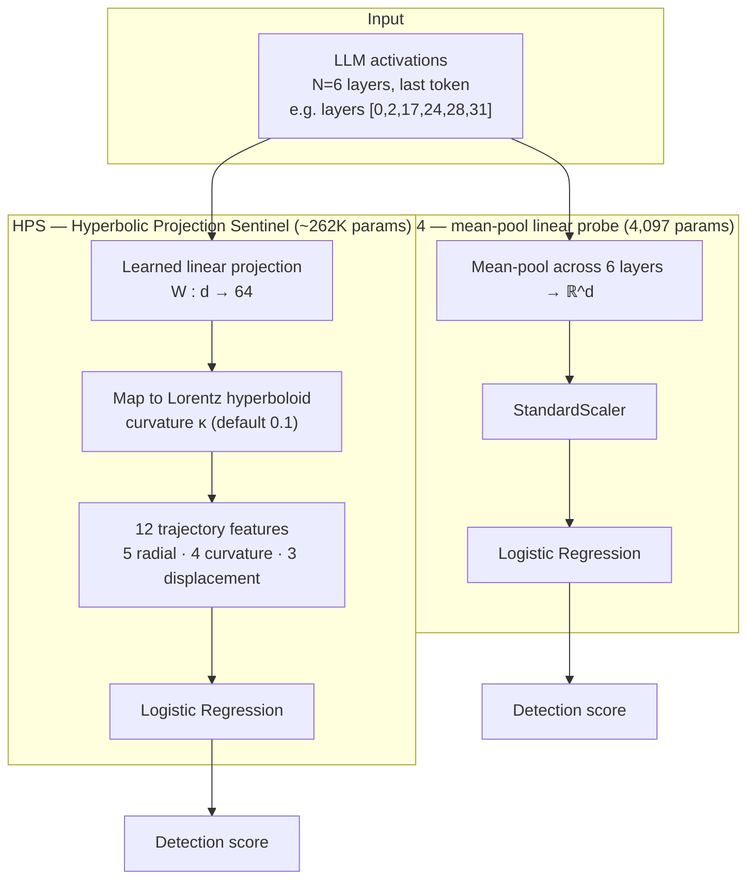
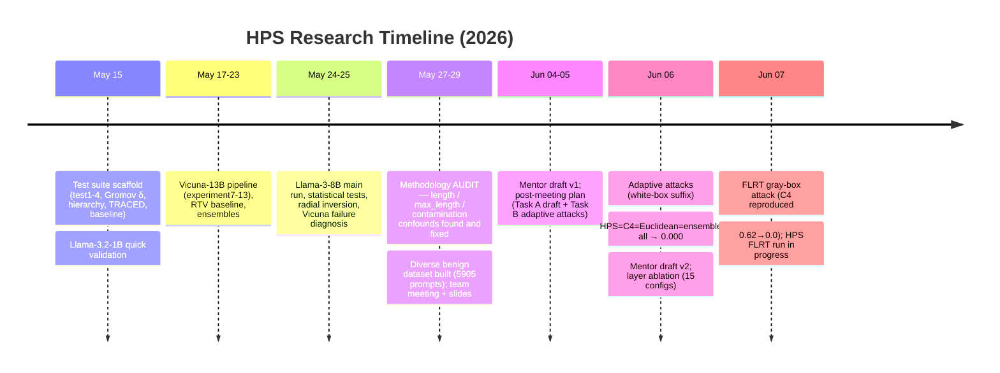
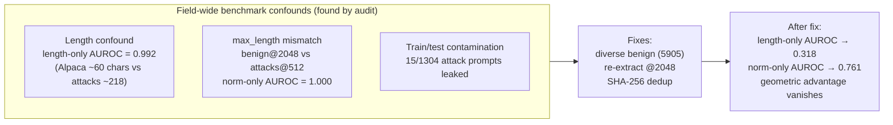
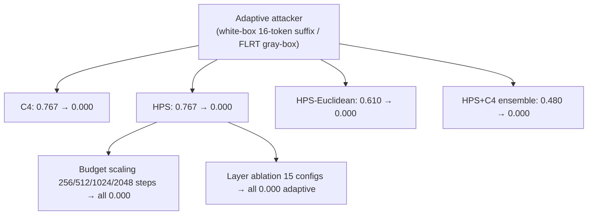

# Project Analysis — HPS Sentinel (Hyperbolic Projection Sentinel)

**Analyzed:** 2026-06-07
**Location:** `/Users/tehabsim/Downloads/files`
**Type:** ML safety research codebase + paper drafts (jailbreak detection from LLM activations)

---

## Executive Summary

This is a **machine-learning safety research project** investigating a single, focused question:

> **Do hyperbolic geometric priors help detect LLM jailbreaks from internal activations, compared to a simple linear probe?**

The project builds **HPS** (Hyperbolic Projection Sentinel) — a defense that projects multi-layer LLM activations onto a Lorentz hyperboloid, extracts 12 "trajectory" features (radial position, curvature, displacement across layers), and classifies benign vs. adversarial prompts. It is compared head-to-head against **C4**, a 4,097-parameter mean-pool linear probe that mirrors production probes at Anthropic and Google DeepMind.

**The result is a rigorous, well-documented negative finding:**

1. **No advantage.** At full data, HPS (≈262K params) and C4 (4,097 params) are statistically indistinguishable on Llama-3-8B (ΔAUROC p=0.082; McNemar p=0.053; Cohen's d≈0.015). Both saturate the benchmark (AUROC≈1.0).
2. **The benchmark was confounded.** An audit found three field-wide methodology flaws (prompt-length confound, `max_length` tokenization mismatch, train/test contamination) that inflate results across many published papers. After fixing them, the geometric advantage disappears.
3. **HPS is fragile.** It catastrophically fails on Vicuna-13B (GCG detection 37.5% vs C4's 100%), traced to an **alignment-strength → signal-concentration → compression-robustness** mechanism. Its hyperparameters don't transfer across models.
4. **The geometric hypothesis is empirically false.** The radial distribution is *inverted* from prediction (benign prompts sit farther from origin than attacks) — robust across 13 configurations in the corrected data.
5. **No adversarial robustness.** Under adaptive attacks (Bailey et al. 2024 style), HPS, HPS-Euclidean, C4, and the HPS+C4 ensemble **all collapse to 0.000 recall**. A real defense exception was not found.

**Recommended venue (per latest drafts):** TMLR, framed as a methodology critique with empirical adversarial-robustness limitations — not a "new SOTA defense" paper.

This is legitimate **defensive** security research (detecting and defending against jailbreaks), conducted with notable scientific honesty — the authors repeatedly revised overstated claims downward as evidence accumulated.

---

## What the Project Is

### Core methods compared

| Method | Params | Geometry | Aggregation | Training | Role |
|---|---|---|---|---|---|
| **HPS** | ~262K | Lorentz hyperboloid | Layer trajectory + 12 feats | Contrastive (50 ep) | The proposed method |
| **HPS-Euclidean** | ~262K (matched) | Flat | Same trajectory pipeline | Contrastive | Ablation: isolates geometry |
| **C4** | 4,097 | Flat | Mean across layers, last token | Discriminative LR | Controlled baseline |
| **MTP** | 4,097 | Flat | Mean across tokens, one layer | Discriminative LR | Anthropic Cheap-Monitors reproduction |
| **RTV** | — | — | Refusal-direction cosine + Mahalanobis | — | External baseline (Derya & Sunar) |
| **JBShield-D** | — | — | Concept activation AND-gate | — | External baseline (USENIX 2025) |

### Models, data, and attacks

- **Target LLMs:** Llama-3-8B-Instruct (32 layers, SFT+RLHF) and Vicuna-13B-v1.5 (40 layers, SFT-only). Config also references `meta-llama/Llama-3.2-1B` for the lightweight test suite.
- **Attack families (9, from JBShield/NISPLab):** autodan, base64, drattack, gcg, ijp, pair, puzzler, saa, zulu.
- **Benign data:** a purpose-built **diverse benign set** of 5,905 prompts from 9 sources (WildChat, OR-Bench Hard, MMLU, GSM8K, HumanEval, MBPP, WikiText, multilingual, Alpaca) — built specifically to defeat the length confound.
- **Adaptive attacks:** Bailey-style 16-token universal embedding suffix (white-box) and FLRT hard-prompt optimizer (gray-box, gradient-free).

---

## Research Arc (chronological)

The narrative is unusually candid. Three documents capture the evolution of the claim:

1. **`research_journey.md`** — the "honest" full story. Top-line: *geometric priors provide no statistically significant advantage*. Documents how initial overstated claims ("we discovered linear probes work", "C4 beats SOTA") were retracted once the authors realized linear probes are established prior art (Anthropic, Google DeepMind).
2. **`post_meeting_plan.md`** — splits work into **Task A** (write the comprehensive mentor draft) and **Task B** (run Bailey-style adaptive attacks to settle the robustness question).
3. **`mentor_draft.md` → `mentor_draft_v2.md`** — v2 reports the adaptive-attack results and finalizes the TMLR framing.

A notable internal correction: the *original* radial finding claimed "13/13 configs confirm the geometric inversion" as evidence *for* a real signal; after the length-confound fix, `post_meeting_plan.md` reports "**0/13 inversions**" and reinterprets the earlier 13/13 as a **length-confound artifact**. (`research_journey.md` and `post_meeting_plan.md` describe the inversion in opposite directions because they were written before vs. after the cache fix — a real, traceable evolution in the project, not a contradiction to hide.)

---

## Key Findings in Detail

### 1. Saturation parity (Llama-3-8B, corrected data)

| Method | AUROC | TPR@5%FPR | TPR@1%FPR |
|---|---|---|---|
| MTP @ L17 (Anthropic exact) | 0.9988 | 0.9946 | 0.9799 |
| C4 (cross-layer) | 0.9986 | 0.9954 | 0.9776 |
| HPS (Lorentz) | 0.9971 | 0.9914 | — |
| HPS-Euclidean (matched flat) | 0.9680 | 0.9311 | — |

Statistics on (HPS − C4): ΔAUROC = −0.0010 (p=0.036, trivially small), ΔTPR@5% p=0.601 (n.s.), McNemar p=0.755 (n.s.), Cohen's d = −0.039 (negligible). **Prediction agreement:** HPS catches **0** examples C4 misses; C4 catches 21 HPS misses; score correlation 0.958 → *HPS behaves as a noisy subset of C4.*

### 2. The three methodology confounds (the real contribution)

These confounds are attributed to affect HSF (WWW 2025), JBShield (USENIX 2025), GradSafe (ACL 2024), and RTV. Anthropic's Cheap Monitors avoided them by using WildChat + OR-Bench Hard. **This audit is the paper's strongest, most reusable contribution.**

### 3. Cross-model failure (Vicuna-13B) — the most striking result

Mean detection across 9 attacks: HPS = 0.61, C4 = 0.99 on Vicuna; both ≈0.99 on Llama-3 (same code/data). The failure is **GCG-specific**:

| Attack (Vicuna) | HPS | C4 |
|---|---|---|
| **gcg** | **7.6% / 37.5%*** | ~99–100% |
| ijp | 32.9% | 93.3% |
| pair | 38.9% | 95.8% |
| saa | 99.4% | 100% |

*\*Different runs/thresholds report 7.6% (full set) and 37.5% (16-sample subset).*

**Mechanism (empirically tested, 6 hypotheses ruled out):** Strong RLHF (Llama-3) concentrates harm-discriminative signal into compact regions that survive HPS's 64-dim compression (100% GCG detection, 172/172). Weak SFT-only alignment (Vicuna) leaves the signal diffuse, so HPS's compression filters it out. C4's full-dim representation is alignment-agnostic. This **alignment-mediated** result is framed as the paper's most novel mechanistic finding.

### 4. Adversarial robustness — comprehensively negative

- **Direct white-box (suffix):** every probe variant collapses to 0.000 adaptive recall.
- **Transfer asymmetry (the one interesting wrinkle):** a C4-trained suffix does *not* transfer to HPS (HPS recall actually *rises* to 1.000), but an HPS-trained suffix fully bypasses C4 (0.000). Robust at n=30 and n=100. **However**, an adaptive ensemble attack on `max(C4,HPS)` bypasses both (0.000), so the asymmetry has no practical defense value.
- **Budget scaling:** HPS breaks at 256 steps just as completely as at 2048 — no robustness margin.
- **Layer ablation (15 configs, latest June work):** every layer-count and layer-position choice → **0.000 adaptive recall** (standard recall varied 0.0–0.6). Confirms layer choice cannot rescue HPS adversarially.
- **FLRT gray-box (latest, June 7):** reproduced Bailey on C4 (standard 0.62 → adaptive 0.000). The HPS FLRT run was still loading the model at the snapshot — **incomplete**.

### 5. Feature collapse & the false geometric hypothesis

- A **single feature** (mean radial position) matches all 12 trajectory features — the framework is over-parameterized.
- Activation-space PGD (idealized, not a real threat model): HPS 96% evasion vs C4 2% — HPS's compressed space is directionally brittle; adversarial training doesn't fix it.
- The radial-distribution hypothesis ("attacks sit at the hyperbolic periphery") is contradicted by the corrected data.

---

## Codebase Structure

```mermaid
flowchart TD
    subgraph Core["Core library"]
        cfg["config.py — model, layers, paths"]
        utils["utils.py — extraction, hyperbolic ops"]
        ds["dataset.py — prompt datasets"]
        hc["hps_core.py — LorentzProjection, lorentz_distance,<br/>curvature, contrastive loss, 12 trajectory feats"]
    end

    subgraph Extract["Activation extraction"]
        e1["extract_diverse_benign_activations.py"]
        e2["extract_llama3_base_activations.py"]
        e3["extract_jbshield_activations.py"]
        e4["fix_cache_max_length.py — re-extract @2048"]
        e5["extract_generation_activations.py"]
    end

    subgraph Audit["Methodology audit"]
        a1["verify_saturation.py — length/norm checks"]
        a2["investigate_contamination.py — SHA-256 dedup"]
        a3["diagnose_norm_confound.py"]
        a4["statistical_tests.py — bootstrap CIs, McNemar"]
        a5["radial_distribution_check.py — 13-config inversion"]
    end

    subgraph Diag["Cross-model diagnosis (Vicuna)"]
        d1["vicuna_diagnostic.py — 6 hypotheses"]
        d2["vicuna_imbalance_test.py — per-attack"]
        d3["gcg_specific_test.py — alignment hypothesis"]
        d4["cross_model_compare.py"]
    end

    subgraph Attack["Adaptive attacks"]
        k1["adaptive_attack.py — white-box suffix, probe wrappers"]
        k2["flrt_attack.py — gray-box FLRT"]
        k3["run_adaptive_attacks.sh / run_flrt_attacks.sh"]
        k4["run_layer_ablation.sh — 15 configs"]
    end

    Core --> Extract --> Audit --> Diag --> Attack
```

### File inventory (≈90 Python files, ~30 markdown docs)

**Foundational tests (May 15):** `test1_gromov_delta.py` (is the space hyperbolic?), `test2_hierarchy.py`, `test3_traced_space.py`, `test4_baseline_comparison.py`, `test5_hps_full.py`, `run_all.py`.

**Experiments:** `experiment6-13.py` (Vicuna pipeline, adversarial training, semantic drift), `hps_llama3.py` (Llama-3 main), `hps_rtv_inspired.py`, `rtv_standalone.py`.

**Strengthening attempts (`strengthen_negative/`):** 5 experiments (hyperbolic methods, information-theoretic, alignment ablation) that tried and failed to turn the negative into a positive; includes `helpers/lorentz_ops.py`.

**Visualization:** `visualize_hps.py`, `visualize_poincare.py`, `visualize_activation_space.py`, `generate_paper_plots.py`, `build_slides.py`, `fig_*.py`, `generate_methodology_diagram.py`.

**Orchestration:** `run_overnight_pipeline.sh` (7-phase), `run_strengthening_pipeline.sh`, `run_diverse_benign_pipeline.sh`, `run_all.sh`.

**Results (`results/`):** ~150 files — JSON metrics, `.pt` trained probes/suffixes, `.npz`/`.csv` activation caches, logs, and `figs/` (PNG/PDF figures). `adaptive_attacks/` holds the suffix experiments + `layer_ablation/` (15 configs). `flrt_attacks/` holds the gray-box runs.

---

## Document Map

| Document | Purpose |
|---|---|
| `research_journey.md` | The honest end-to-end story + negative finding (best single read) |
| `mentor_draft.md` / `mentor_draft_v2.md` | Mentor-facing paper drafts; v2 = adaptive-attack addendum |
| `mentor_draft.WITH_CONFOUNDS.md.bak` | Backup of pre-fix version (kept for traceability) |
| `post_meeting_plan.md` | Task A (draft) + Task B (adaptive attacks) plan; Bailey deep-read |
| `paper_draft.md` / `paper_outline.md` | Formal paper structure |
| `paper_supplementary.py` | Supplementary stats generation |
| `HPS_Document.md` / `HPS_Findings.md` | Earlier consolidated method + findings docs |
| `literature_review_activation_defenses.md` | Related-work analysis |
| `mentor_reading_list.md` | Tier-1 citations for mentor |
| `mentor_briefing.md` | High-level overview |
| `evaluation_report.md` | AI evaluator's review of the work |
| `research_plan_strengthening.md` / `plan_a.md` | Plans to strengthen the negative result |
| `research_opportunities.md` | Future directions |
| `detas-eta-strategy-analysis.md` | Strategy analysis note |
| `README.md` / `RUN_INSTRUCTIONS.md` / `README_adaptive_attacks.md` | Setup + DGX run instructions |
| `team_meeting_slides.md` + `team_meeting.pptx` | Team meeting deck |

---

## Technical Stack

- **Python** with `torch>=2.1`, `transformers>=4.40`, `accelerate`, `numpy`, `scikit-learn`, `matplotlib`. Optional: `geoopt` (Riemannian optimizers), `baukit` (hooks), `datasets`.
- **Compute:** NVIDIA A100-SXM4-80GB (DGX, path `/mnt/lab/Mo/hps/hps2/hps/`); models in fp16, probes/attacks in fp32 at boundaries; 4-bit quantization optional.
- **Geometry core:** Lorentz hyperboloid model — Minkowski inner product, geodesic distance via `arccosh`, discrete triangle-inequality curvature, contrastive loss with per-layer temperature τ and learnable curvature κ.

---

## Assessment & Observations

**Strengths**
- **Scientific honesty.** Claims are repeatedly revised downward; prior art is acknowledged; the `.bak` and dual journey/plan docs preserve the evolution rather than hiding it.
- **Rigor.** Bootstrap CIs, McNemar, parameter-matched ablations, multi-seed (σ=0.000), 6-hypothesis diagnosis, 15-config layer ablation, both white-box and gray-box adaptive attacks.
- **The methodology audit is genuinely valuable** to the field independent of HPS.

**Weaknesses / open items (acknowledged in the docs)**
- Only 2 LLMs; benchmark likely saturated; leave-one-out ≠ true OOD.
- JBShield self-reproduction gave 0.55 vs their published 0.94 — comparison relies on published numbers.
- **The FLRT-vs-HPS gray-box run appears incomplete** (`attack_hps_flrt.json` absent; phase-1 log ends at model load) — the only adaptive cell not yet closed.
- Generation-based HPS (the most promising future direction, Bailey §3.6) is proposed but not implemented.

**Bottom line:** A methodologically careful, honest **negative-result** study. The contribution is the controlled geometric-vs-linear comparison, the cold-start methodology, the cross-model alignment-mediated fragility finding, and the benchmark-confound audit — not a new defense. The latest June work (adaptive attacks + layer ablation) closes the adversarial-robustness question firmly in the negative, pointing the draft toward a TMLR methodology-critique submission.

---

## Sources

All sources are local files within `/Users/tehabsim/Downloads/files` (read directly during analysis on 2026-06-07):

- `README.md`, `requirements.txt`, `config.py`, `hps_core.py` — accessed 2026-06-07
- `research_journey.md` — accessed 2026-06-07
- `mentor_draft_v2.md` — accessed 2026-06-07
- `post_meeting_plan.md` — accessed 2026-06-07
- `README_adaptive_attacks.md` — accessed 2026-06-07
- `results/flrt_attacks/attack_c4_flrt.json`, `results/flrt_attacks/suffix_c4_flrt.json`, `results/flrt_attacks/log_phase1_hps.txt`, `results/log_flrt_phase0_v2.txt`, `results/log_flrt_phases12.txt` — accessed 2026-06-07
- `results/adaptive_attacks/eval_n100_*.json`, `results/adaptive_attacks/layer_ablation/*/result.json`, `results/adaptive_attacks/layer_ablation/run3232.log` — accessed 2026-06-07

External references cited *within* the project's own documents (not re-fetched during this analysis; URLs as recorded in `research_journey.md`):

- ⚠️ External link — [Bailey et al.: Obfuscated Activations Bypass LLM Latent-Space Defenses (ICLR 2026)](https://arxiv.org/abs/2412.09565)
- ⚠️ External link — [JBShield (USENIX Security 2025)](https://arxiv.org/abs/2502.07557)
- ⚠️ External link — [Anthropic: Cost-Effective Constitutional Classifiers / Cheap Monitors](https://alignment.anthropic.com/2025/cheap-monitors/)
- ⚠️ External link — [Detecting High-Stakes Interactions with Activation Probes (ICML 2025)](https://arxiv.org/abs/2506.10805)
- ⚠️ External link — [HypLoRA (NeurIPS 2025)](https://arxiv.org/abs/2405.18515)
- ⚠️ External link — [HELM (NeurIPS 2025)](https://arxiv.org/abs/2505.24722)
- ⚠️ External link — [Nickel & Kiela: Poincaré Embeddings (NeurIPS 2017)](https://arxiv.org/abs/1705.08039)
- ⚠️ External link — [Wollschläger et al.: Geometry of Refusal in LLMs (ICML 2025)](https://arxiv.org/abs/2502.17420)
- ⚠️ External link — [GradSafe (ACL 2024)](https://arxiv.org/abs/2402.13494), [HSF (WWW 2025)](https://arxiv.org/abs/2409.03788), [Gradient Cuff (NeurIPS 2024)](https://arxiv.org/abs/2403.00867), [Token Highlighter (AAAI 2025)](https://arxiv.org/abs/2412.18171)
