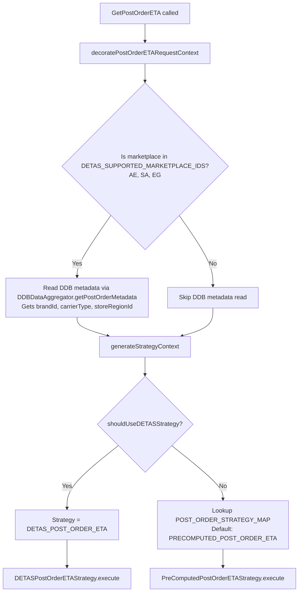
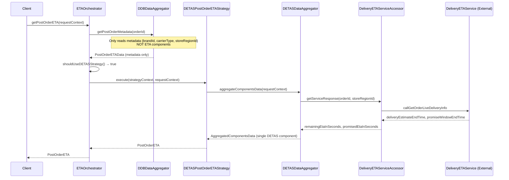
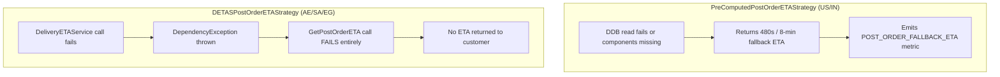

# DETAS (DeliveryETAService) Strategy Analysis — TezETAService

## Executive Summary

AE (and SA, EG) use the **`DETASPostOrderETAStrategy`** which calls the external **DeliveryETAService** in real-time — it does **NOT** use the DDB precomputed ETAs from TezETAAsync for the actual ETA calculation. The DDB is only read for **metadata** (brandId, carrierType, storeRegionId) needed for strategy routing decisions.

This is fundamentally different from the US/IN `PreComputedPostOrderETAStrategy` which reads individual ETA components from DDB and sums them up (with an 8-minute fallback if components are missing).

---

## How AE Strategy Selection Works



### `shouldUseDETASStrategy` Logic

```java
private boolean shouldUseDETASStrategy(PostOrderETARequestContext requestContext) {
    return DETAS_SUPPORTED_MARKETPLACE_IDS.contains(requestContext.getMarketplaceId())
            && !featuresConfig.isMenaQcEtaMigrationEnabled(
                    requestContext.getMarketplaceId(), requestContext.getStoreRegionId());
}
```

- **DETAS_SUPPORTED_MARKETPLACE_IDS** = `[AE_PROD, SA_PROD, EG_PROD]`
- **MENA_QC_ETA_MIGRATION_WEBLAB** = `MENA_QC_1P_ETA_MIGRATION_1352226`

**Current state (weblab OFF):** AE → uses `DETASPostOrderETAStrategy`  
**Future state (weblab ON):** AE → falls through to `POST_ORDER_STRATEGY_MAP` → no AE entry exists → defaults to `PRECOMPUTED_POST_ORDER_ETA`

---

## DETAS Strategy Flow (Current AE Path)



---

## Key Differences: DETAS vs PreComputed Strategy

| Aspect | PreComputedPostOrderETAStrategy (US/IN) | DETASPostOrderETAStrategy (AE/SA/EG) |
|--------|----------------------------------------|--------------------------------------|
| **Data source for ETA** | DDB (TezETAAsync precomputed components) | Real-time call to DeliveryETAService |
| **Components needed** | 4: PICKING_ASSIGNMENT_TIME, PICKING_TIME, ASSIGNMENT_TIME, TRANSIT_TIME | 1: Single DETAS response |
| **Fallback on missing data** | Returns 480s (8 min) fallback ETA | **Throws DependencyException** — call fails |
| **ETA smoothening** | Yes (DoubleExponential / LinearDecay) | No |
| **Delivery status** | BEFORE_TIME / DELAYED / ON_TIME logic | Hardcoded ON_TIME |
| **Store threshold check** | Yes (ETA_EXCEEDS_STORE_THRESHOLD) | No |
| **Min ETA floor** | 60s | 60s (enforced in accessor) |

---

## How AE Uses DDB Precomputed ETAs from TezETAAsync

**Answer to Istvan's question:** AE does **NOT** use the DDB precomputed ETAs for the actual ETA value. Here's what happens:

1. **DDB is read only for metadata** — `ETAOrchestrator.decoratePostOrderETARequestContext()` calls `ddbDataAggregator.getPostOrderMetadata(orderId)` which reads a single record from DDB to get `brandId`, `carrierType`, and `storeRegionId`.

2. **The storeRegionId from DDB metadata** is used for the weblab check in `shouldUseDETASStrategy()` and is also passed to the DeliveryETAService call.

3. **The actual ETA** comes from calling `DeliveryETAServiceClient.callGetOrderLiveDeliveryInfo()` which returns `deliveryEstimateEndTime` and `promiseWindowEndTime`. The accessor computes: `remainingETA = max(60s, deliveryEstimateEndTime - now)`.

4. **If DDB metadata read fails** (returns null), the orchestrator still proceeds — `storeRegionId` will be null, `isMenaQcEtaMigrationEnabled` returns false (null check), so it still routes to DETAS strategy. The DETAS call will just have a null storeRegionId.

5. **If the DETAS service call fails**, `DeliveryETAServiceAccessor` throws a `DependencyException`, which propagates up through `DETASDataAggregator` → `PostOrderETAStrategy.execute()` → the entire `GetPostOrderETA` call fails with no fallback.

---

## Failure Modes Comparison



---

## Answer to Istvan's Question

> "How does AE use the DDB precomputed ETAs from TezETAAsync?"

**AE does not use DDB precomputed ETAs for the ETA value itself.** The DDB is only used to fetch order metadata (brandId, carrierType, storeRegionId) for routing/enrichment purposes. The actual ETA comes from a real-time call to DeliveryETAService (`GetOrderLiveDeliveryInfo` API).

The precomputed ETA components in DDB (PICKING_ASSIGNMENT_TIME, PICKING_TIME, ASSIGNMENT_TIME, TRANSIT_TIME) that TezETAAsync writes are only consumed by the `PreComputedPostOrderETAStrategy` — which AE is **not** currently using.

**When the MENA_QC_ETA_MIGRATION weblab is turned ON**, AE will switch to `PreComputedPostOrderETAStrategy` and will then start consuming those DDB precomputed components (and will be subject to the 8-minute fallback if components are missing).

---

## Sources

- [PreComputedPostOrderETAStrategy.java](https://code.amazon.com/packages/TezETAService/blobs/mainline/--/src/com/amazon/tezetaservice/postordereta/strategy/PreComputedPostOrderETAStrategy.java) — accessed 2026-05-19
- [DETASPostOrderETAStrategy.java](https://code.amazon.com/packages/TezETAService/blobs/mainline/--/src/com/amazon/tezetaservice/postordereta/strategy/DETASPostOrderETAStrategy.java) — accessed 2026-05-19
- [ETAOrchestrator.java](https://code.amazon.com/packages/TezETAService/blobs/mainline/--/src/com/amazon/tezetaservice/orchestrator/ETAOrchestrator.java) — accessed 2026-05-19
- [DeliveryETAServiceAccessor.java](https://code.amazon.com/packages/TezETAService/blobs/mainline/--/src/com/amazon/tezetaservice/accessor/DeliveryETAServiceAccessor.java) — accessed 2026-05-19
- [DETASDataAggregator.java](https://code.amazon.com/packages/TezETAService/blobs/mainline/--/src/com/amazon/tezetaservice/postordereta/aggregator/DETASDataAggregator.java) — accessed 2026-05-19
- [DDBDataAggregator.java](https://code.amazon.com/packages/TezETAService/blobs/mainline/--/src/com/amazon/tezetaservice/postordereta/aggregator/DDBDataAggregator.java) — accessed 2026-05-19
- [CommonConstants.java](https://code.amazon.com/packages/TezETAService/blobs/mainline/--/src/com/amazon/tezetaservice/constants/CommonConstants.java) — accessed 2026-05-19
- [StrategyConstants.java](https://code.amazon.com/packages/TezETAService/blobs/mainline/--/src/com/amazon/tezetaservice/constants/StrategyConstants.java) — accessed 2026-05-19
- [FeaturesConfig.java](https://code.amazon.com/packages/TezETAService/blobs/mainline/--/src/com/amazon/tezetaservice/config/FeaturesConfig.java) — accessed 2026-05-19
- [WeblabConstants.java](https://code.amazon.com/packages/TezETAService/blobs/mainline/--/src/com/amazon/tezetaservice/constants/WeblabConstants.java) — accessed 2026-05-19
