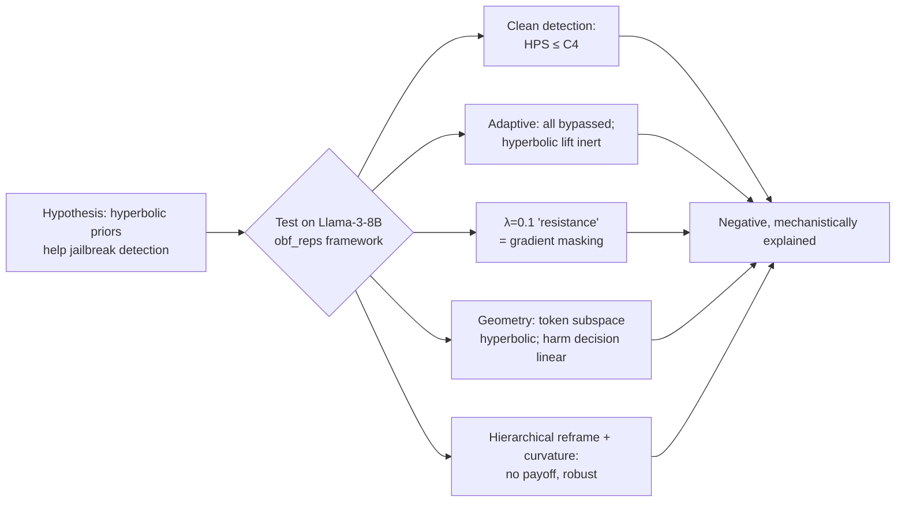
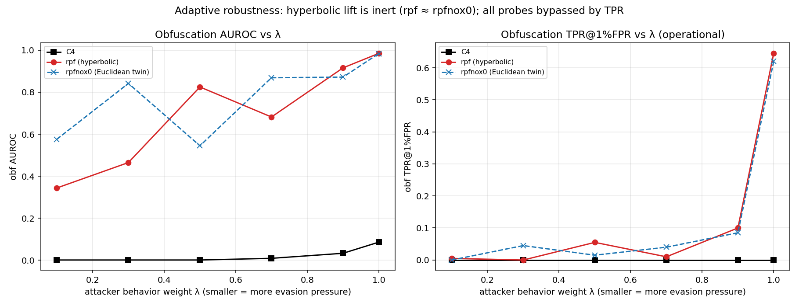
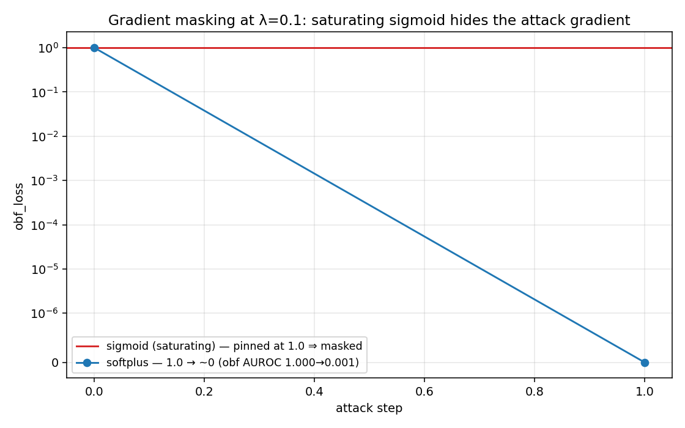
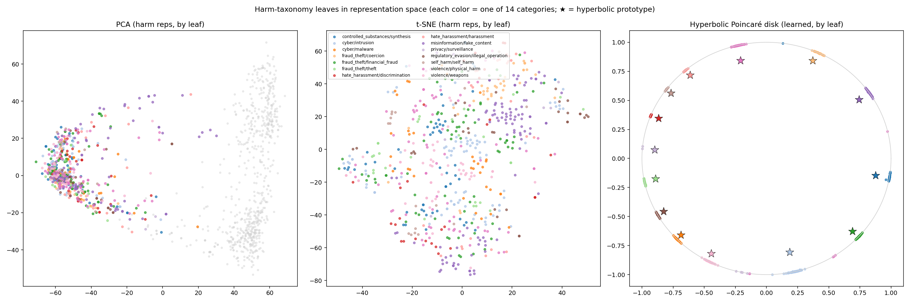
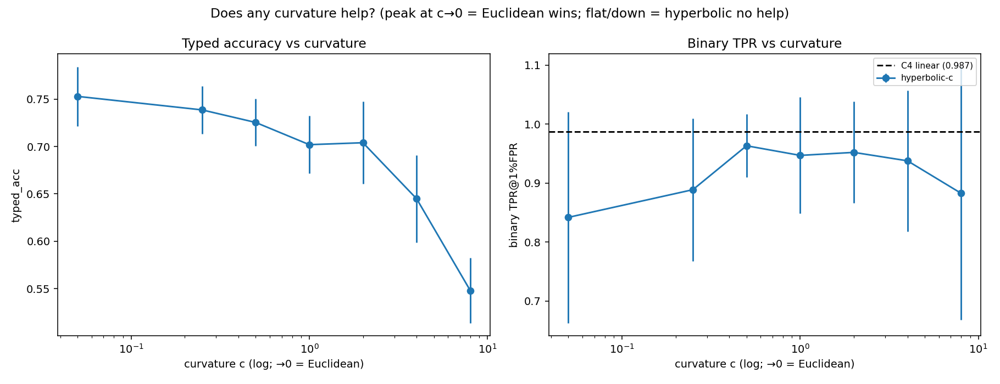
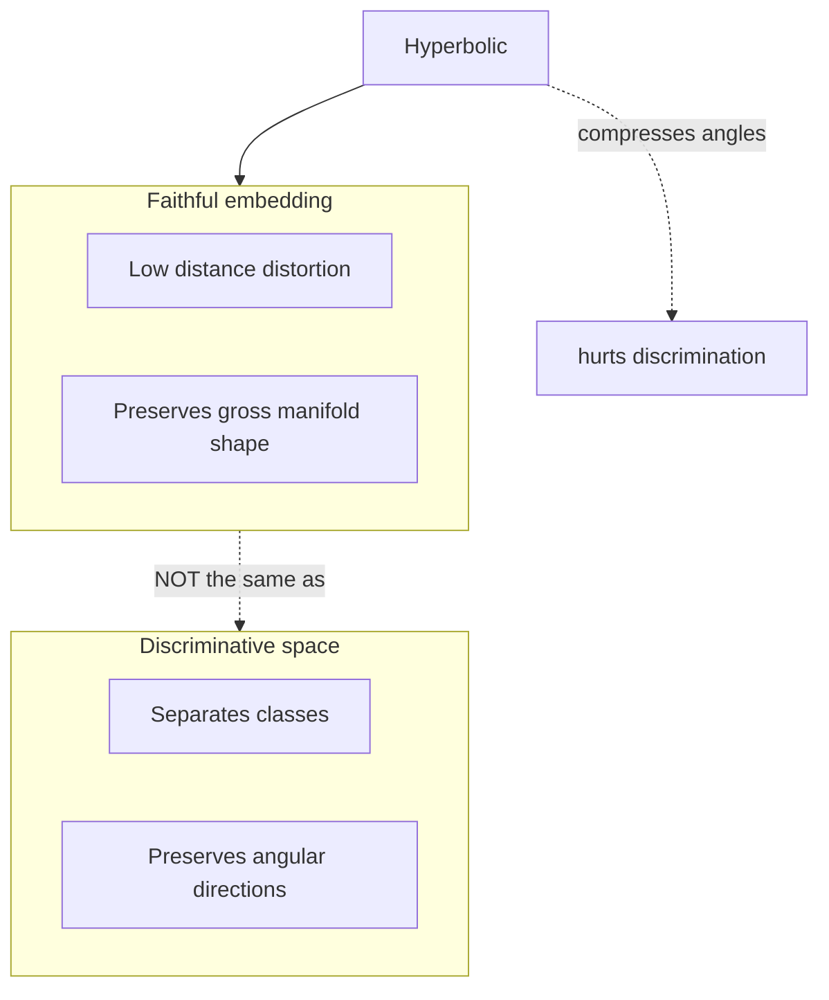

# When Hyperbolic Geometry Doesn't Help: A Mechanistic Negative Result for LLM Jailbreak Detection

*…and a cautionary methodology for measuring representation curvature without fooling yourself.*

**Authors:** Balhousani Alhussien¹, *et al.* — ¹ [Affiliation]
**Contact:** [email] · **Code:** `Mtehabsim/hps` · **Preprint, v1**

---

## Abstract

Hyperbolic representations embed hierarchies with far lower distortion than Euclidean space, and recent work (HELM) shows that the token/vocabulary subspace of large language models is intrinsically hyperbolic. This motivates a natural hypothesis: *geometric priors that respect this structure should improve safety probes that detect jailbroken or harmful activations.* We test this hypothesis rigorously on Llama‑3‑8B‑Instruct using the *Obfuscated Activations* adversarial framework, comparing a hyperbolic probe (Hyperbolic Projection Sentinel, HPS) and several controlled hyperbolic variants against a strong linear baseline (per‑layer logistic regression, "C4"), on both clean detection and adaptive (gradient‑based soft‑prompt) robustness.

We find **no benefit from hyperbolic geometry for jailbreak detection, and at strong curvature an actual cost.** The result is robust across probe architecture, curvature, hierarchy specification, layer choice, and attack type. Along the way we (i) **causally diagnose** an apparent hyperbolic "robustness" effect as **gradient masking** (a saturating output nonlinearity), which disappears under a non‑saturating surrogate; (ii) show that **popular curvature statistics (δ‑hyperbolicity, Ollivier–Ricci) are unreliable at LLM dimensionality** and that even a calibration‑passing embedding‑distortion measure requires a dimension‑matched random baseline; and (iii) give a mechanistic account: the harm *decision* is **linearly separable**, so no curved geometry can improve separability, even though the harm *category taxonomy* is genuinely (mildly) hyperbolic. We argue the practical contribution is twofold — a reusable methodology for measuring representation geometry, and a clear boundary for when hyperbolic priors help (objectives that *are* hierarchies) versus when they do not (flat, linearly‑separable decisions).

**Keywords:** hyperbolic representations, jailbreak detection, activation probing, adversarial robustness, gradient masking, representation geometry.

---

## 1. Introduction

Activation probes — linear or shallow classifiers on a model's hidden states — are a leading approach to detecting harmful or jailbroken model behavior. A natural question is whether the *geometry* in which a probe operates matters. Two observations make hyperbolic geometry an attractive candidate:

1. **Hierarchies embed efficiently in hyperbolic space.** Negative curvature gives exponential volume growth that matches the branching of trees and taxonomies; hierarchical data embeds with far lower distortion than in Euclidean space (Nickel & Kiela, 2017; Sala et al., 2018).
2. **LLM token spaces are hyperbolic.** HELM (2025) shows the token/vocabulary subspace of LLMs exhibits hyperbolic structure and that mixture‑of‑curvature components improve language modeling.

If harmful concepts form a semantic hierarchy, a hyperbolic probe might (a) detect harm more accurately and/or (b) be harder to evade adaptively. We set out to test this with a purpose‑built hyperbolic probe and a battery of controls.

**Our finding is negative, but informative.** Hyperbolic geometry provides no advantage for jailbreak detection on Llama‑3‑8B‑Instruct, and we trace *why*, ruling out the usual ways such a study can mislead itself (gradient masking, high‑dimensional curvature artifacts, hierarchy mis‑specification, unlucky curvature). The contribution is therefore two‑fold:

- **A mechanistic negative result** (Sections 5–6): hyperbolic priors don't help a task whose decision is linearly separable; we explain the mechanism and show the result is robust.
- **A measurement methodology** (Section 5.4): how to measure representation curvature without being fooled by dimensionality — every geometry statistic must be calibrated against dimension‑matched random baselines.



---

## 2. Background and Related Work

**Hyperbolic representation learning.** The Poincaré ball and the Lorentz/hyperboloid model are isometric coordinate systems for the same constant‑negative‑curvature geometry. The Lorentz model is numerically preferable for optimization (no boundary gradient blow‑up), and we adopt it throughout. Hyperbolic prototype networks and hyperbolic multinomial regression provide classifiers in this geometry.

**Hyperbolicity in LLMs.** HELM (arXiv:2505.24722) demonstrates hyperbolic structure in token embeddings and proposes mixture‑of‑curvature experts. We *reproduce* the token‑subspace finding with a calibrated distortion measure, but show it does not extend to the harm‑decision direction.

**Obfuscated activations / adaptive probing.** Bailey et al. ("Obfuscated Activations") frame an attacker–defender game: an attacker optimizes a soft prompt (or hard tokens) to (a) elicit harmful behavior while (b) keeping the probe's score "benign." This is the adversarial setting we use; the operational metric is **TPR at 1% FPR** under attack.

**Gradient masking.** Athalye, Carlini & Wagner (2018) show that defenses which *obscure gradients* can appear robust while being trivially bypassed by gradient‑free or surrogate attacks. We find this phenomenon is the cause of an apparent hyperbolic robustness effect (Section 5.3).

---

## 3. Threat Model and Experimental Setup

**Model.** Llama‑3‑8B‑Instruct. Activations are taken at a spread of transformer layers; last‑token (or mean‑over‑sequence) representations.

**Attacker–defender game.** The defender trains a probe to separate harmful from benign activations. The attacker minimizes a weighted loss
$$\mathcal{L} = \lambda\,\mathcal{L}_{\text{behavior}} + (1-\lambda)\,\mathcal{L}_{\text{obf}},$$
where $\mathcal{L}_{\text{behavior}}$ drives the model to comply with a harmful request and $\mathcal{L}_{\text{obf}}$ drives the probe to score the activation as benign. **λ is the behavior weight**; small λ emphasizes evasion. We sweep λ ∈ {0, 0.1, 0.3, 0.5, 0.7, 0.9, 1.0}.

**Metrics.** Clean detection: AUROC and TPR@1%FPR. Adaptive: obfuscation AUROC and **TPR@1%FPR under attack** (operational), plus jailbreak rate (StrongREJECT‑style judge) to confirm the attack actually elicits harm.

```mermaid
flowchart LR
    A[Harmful request] --> M[(LLM)]
    SP[Soft prompt θ] --> M
    M --> Reps[Activations]
    Reps --> P{Probe}
    P -- harmful? --> D[Detector score]
    A -. behavior loss .-> Opt[Attacker minimizes\nλ·behavior + (1-λ)·obf]
    D -. obf loss .-> Opt
    Opt --> SP
```

---

## 4. Methods

### 4.1 Probes compared

| Probe | Description | Role |
|---|---|---|
| **C4** | Per‑layer logistic regression, late fusion | Strong **linear baseline** |
| **HPS‑12** | Hyperbolic Projection Sentinel: project activations to a Lorentz hyperboloid, 12 cross‑layer trajectory features, LR head | Hyperbolic probe under test |
| **rpf** (`raw_proj_full`) | Full 4096‑dim activation lifted to hyperboloid (+ x₀ radial coord), mean‑pooled, single LR | Isolates the hyperbolic lift |
| **rpfnox0** | Identical to rpf **without** the x₀ lift (Euclidean twin) | Control: rpf vs rpfnox0 = *pure hyperbolic effect* |
| **HHD** | Hierarchical‑hyperbolic detector: joint content clustering → leaves with harm‑fraction attribute → Lorentz prototype net | Hierarchical reframe (Section 5.5) |

The key controlled contrast is **rpf vs rpfnox0**: they are identical except for the single hyperbolic radial coordinate, so any difference is *exactly* the hyperbolic contribution. **C4 vs rpfnox0** isolates the (Euclidean) layer‑fusion architecture.

### 4.2 Measuring representation geometry (calibrated)

We measure how well representations embed into each constant‑curvature geometry (Hyperbolic / Euclidean / Spherical) via **embedding distortion** (fit a metric, compare preserved pairwise distances). Crucially:

- We **calibrate** the estimator on known geometries (a tree, a sphere, a flat Gaussian) at matched dimension; it must recover the correct geometry to be trusted.
- We include a **mandatory dimension‑matched random baseline** (a "floor"), because the kNN‑geodesic construction makes *any* high‑dimensional cloud look hyperbolic.
- We show δ‑hyperbolicity and Ollivier–Ricci curvature **fail** this calibration at LLM dimensionality and are therefore not used for conclusions.

### 4.3 Adaptive attacks and a masking‑safe protocol

We attack each probe with gradient‑based soft prompts (and GCG hard tokens). Because saturating output nonlinearities can *fake* robustness by killing gradients (Section 5.3), every adaptive result follows a **masking‑safe protocol**:

1. Use a **non‑saturating** obfuscation signal (softplus, not sigmoid) so the attack gradient never vanishes; this is monotonic in the score, so **clean detection metrics are unchanged**.
2. **Verify the obfuscation loss actually descends** during the attack; a pinned loss indicates masking and invalidates a "resists" reading.
3. Where possible, cross‑check with a **gradient‑free** attack.

For the hierarchical detector we additionally replace hard tangent‑norm clamps with a smooth soft‑clamp so the exp‑map has no zero‑gradient region.

---

## 5. Results

### 5.1 Clean detection: hyperbolic ≤ linear

The linear baseline C4 is at ceiling (AUROC ≈ 0.999–1.000, TPR@1%FPR ≈ 1.0). HPS‑12 is **weaker** (AUROC ≈ 0.92–0.94, substantially lower TPR). The full‑dimensional hyperbolic lift is **inert**: **rpf ≡ rpfnox0** at every λ on clean detection (identical AUROC/TPR). Any small rpf‑over‑C4 edge is shared by the *Euclidean* twin rpfnox0 and is therefore **architectural** (mean‑pool early fusion), not geometric.

### 5.2 Adaptive robustness: all probes bypassed; the hyperbolic lift is inert

By the operational metric (TPR@1%FPR under attack), **every probe is bypassed** at the λ an attacker would choose (0.1–0.9): C4 ≈ 0; rpf/rpfnox0 ≈ 0–0.10 (marginally less bypassed, but again *equal between the hyperbolic probe and its Euclidean twin*).

*Adaptive soft‑prompt λ‑sweep (obf TPR@1%FPR; lower = more bypassed):*

| λ | C4 | rpf (hyperbolic) | rpfnox0 (Euclidean twin) |
|---|---|---|---|
| 0.1 | 0.000 | 0.005 | 0.000 |
| 0.3 | 0.000 | 0.000 | 0.045 |
| 0.5 | 0.000 | 0.055 | 0.015 |
| 0.7 | 0.000 | 0.010 | 0.040 |
| 0.9 | 0.000 | 0.100 | 0.085 |
| 1.0 | — | 0.645 | 0.620 |

**rpf ≈ rpfnox0 across the entire curve ⇒ the hyperbolic coordinate adds nothing to adaptive robustness.**



*Figure 1. Adaptive robustness vs attacker weight λ. The hyperbolic probe (rpf) tracks its Euclidean twin (rpfnox0); by TPR@1%FPR all probes are bypassed.*

### 5.3 The λ=0.1 "resistance" is gradient masking (causally demonstrated)

HPS appeared to *resist* evasion at λ=0.1 (obfuscation AUROC = 1.000). This is **gradient masking**, not robustness. With the original sigmoid output, the obfuscation loss is **pinned at exactly 1.0 for all optimization steps** — the sigmoid saturates at a logit ≈ +50, where the slope $p(1-p)\approx 0$ kills the attack gradient. Swapping to a **non‑saturating softplus** signal (monotonic, so detection metrics are unchanged):

| Output signal | obf_loss trajectory | obf AUROC @ λ=0.1 | clean AUROC |
|---|---|---|---|
| sigmoid (saturating) | pinned at 1.0 | **1.000** (looks robust) | 0.918 |
| softplus (non‑saturating) | 1.0 → ~2.7e‑10 | **0.001** (fully evaded) | 0.909 |

Removing the saturation removes the "resistance" — an **interventional** proof that the effect was masking. HPS has **no** real robustness advantage at any λ.



*Figure 2. Gradient masking. Under the saturating sigmoid the obfuscation loss never descends (apparent robustness); under softplus it collapses and the probe is fully evaded, with clean detection unchanged.*

### 5.4 Where hyperbolicity lives — and a calibration caveat

Using the **calibrated** embedding‑distortion estimator (which passes the known‑geometry gate, whereas δ and Ollivier–Ricci do not):

- **Token/vocabulary subspace is decisively hyperbolic:** distortion $H = 0.003$, ≈ **0.02× the dimension‑matched random floor**. This reproduces HELM with a validated method.
- **Harm last‑token representations are only weakly hyperbolic:** $H \approx 0.53\times$ the random floor (mild), and the **harm decision is linear** (C4 ≈ 1.0).


*Figure 3. Where hyperbolicity lives. Hyperbolic structure is strong in the token subspace but weak in the harm‑decision direction.*


*Figure 4. Methodology caveat. δ‑hyperbolicity and Ollivier–Ricci invert known geometries at LLM dimensionality; only a calibration‑passing, baseline‑corrected estimator is trustworthy.*

**Methodological takeaway:** every curvature statistic must be reported relative to a dimension‑matched random baseline through the identical pipeline; otherwise high‑dimensional concentration manufactures spurious "hyperbolicity."

### 5.5 Hierarchical reframe: the structure exists, but there is no detection payoff

Could a probe that *uses* the harm taxonomy benefit from hyperbolic geometry?

**The hierarchy is genuinely hyperbolic (green‑light gate).** Harm‑category centroids: $H=0.017$ vs $E=0.184$ (≈10× better hyperbolic fit), $H/\text{floor}=0.55$, and taxonomy alignment Spearman $=0.244$ vs shuffle‑null $0.077$ ($p=0.003$). So the structure a hierarchical‑hyperbolic detector needs *exists*.

**But the detector shows no net advantage:**

| Variant | Typed acc (14‑way) | Binary TPR@1%FPR |
|---|---|---|
| C4 (linear) | — | **0.987** |
| Hyperbolic prototype | 0.701 | 0.929 |
| Euclidean prototype | **0.735** | 0.241* |

\*The Euclidean‑prototype's low binary TPR is an artifact of a single benign prototype; see below.

**Robustness of the negative (the key checks):**

- **β=0 ablation** (remove the imposed tree regularizer): unchanged.
- **Data‑driven hierarchy** (cluster harm+benign jointly into leaves; *the fairer design* where harm is a per‑leaf attribute, not the top split): clusters are **~99% pure**, fixing the single‑benign artifact (Euclidean binary TPR 0.24 → **0.984**) — **but this equalizes hyperbolic and Euclidean** (H 0.989 ≈ E 0.984), both **below C4 (0.996)**. A better hierarchy makes the *Euclidean baseline catch up*; it does not make hyperbolic win.



*Figure 5. The harm‑category leaves in representation space and on the learned Poincaré disk. The taxonomy is real, but separating harm from benign does not require it.*

### 5.6 Curvature sweep: Euclidean is optimal

Using a curvature‑$c$ Lorentz model where $c\to 0$ recovers Euclidean, we sweep the entire range. **Typed accuracy is highest at $c\to 0$ and decreases monotonically with curvature:**

| $c$ | 0.05 (≈Euclidean) | 0.25 | 0.5 | 1 | 2 | 4 | 8 |
|---|---|---|---|---|---|---|---|
| typed_acc | **0.753** | 0.739 | 0.726 | 0.702 | 0.704 | 0.645 | 0.548 |

No curvature beats C4 on binary (0.987). Since the hyperbolic *model* (Lorentz/Poincaré/Klein) is isometric and the *curvature* is swept, **the negative is robust to the hyperbolic configuration, not just one setting.**



*Figure 6. Curvature sweep. More curvature monotonically hurts the hierarchical task; Euclidean (c→0) is optimal and no curvature beats the linear baseline.*

### 5.7 The overlap is adversarial, not natural

Visualizing clean vs attacked representations: clean harmful and benign are **cleanly separated**; the attack **drags harmful representations off their cluster into the probe‑benign region**. The harm/benign overlap a probe must contend with is **adversarially induced**, not a natural, partitionable property of the data — which is *why* finer categories or richer hierarchies cannot help (the attacker re‑optimizes against any boundary in a continuous space).


*Figure 7. Clean harmful/benign are separable; the attack creates the overlap. Same story for a linear (C4) and a hyperbolic (HPS) probe.*

---

## 6. Why Hyperbolic Geometry Doesn't Help Here (Mechanism)

Three mutually reinforcing reasons:

1. **The harm decision is linearly separable.** A linear probe reaches ceiling and clean clusters are ~99% pure. When classes are already linearly separable, *no* curved geometry can improve separability — there is no hierarchical structure *in the decision* for curvature to exploit. The category taxonomy is mildly hyperbolic, but it is tangential to the harm‑vs‑benign boundary.

2. **Faithful ≠ discriminative.** Hyperbolic space embeds the manifold's *distances* with low distortion (a faithful container), but its exponential metric **compresses the angular directions that separate classes**. So a faithful hyperbolic embedding classifies no better, and at higher curvature monotonically worse (Figure 6). Low reconstruction distortion does not imply task usefulness.



3. **Adaptive robustness is about causal separability, not geometry.** An attacker optimizing in activation space moves the representation across the decision boundary regardless of whether that boundary is straight or curved. Reshaping the space cannot raise the attack cost; the limiter is the threat model and whether the probe's feature is *causally necessary* for the harmful behavior.

**Every prediction of this account holds**: the hyperbolic lift is inert (rpf ≡ rpfnox0), hyperbolic never beats linear, and each apparent win reduces to an artifact (gradient masking; high‑dimensional concentration; a single benign blob).

---

## 7. Implications and Applications

The result is a *boundary*, not a dead end. **Hyperbolic geometry helps when the task objective is itself a hierarchy — not when it is a flat, linearly‑separable decision.**

**Where hyperbolic pays off (consistent with our findings):**
- Hierarchical/taxonomic embedding and retrieval (ontologies, knowledge graphs, entailment).
- LLM architecture for language modeling (HELM) — the token subspace *is* hyperbolic (validated here).
- Deep hierarchical classification with many‑level label trees; compact low‑dimensional embeddings of hierarchies; interpretability/visualization of a model's concept hierarchy.

**Transferable methodology (any representation‑geometry study):**
- Baseline‑correct *all* curvature statistics against dimension‑matched random data.
- Treat "faithful embedding" and "discriminative space" as different objectives; choose geometry by task structure.

**For safety specifically:** invest in output‑level monitoring, attack‑surface constraints, randomized/ensemble probes, and causally‑necessary features — not in probe geometry — for adaptive robustness.

---

## 8. Limitations and Future Work

- **Single model / framework.** Llama‑3‑8B‑Instruct and the `obf_reps` framework. Generalization to other models and scales is untested and is the most important next step.
- **Hard‑token (GCG) arm is partial.** GCG infrastructure runs and C4 ≫ HPS on detection, but in our runs GCG did not reach high jailbreak rates, so the hard‑token adaptive comparison (including rpf/rpfnox0 over multiple behaviors) is not yet a fully valid evasion test. This does not affect the soft‑prompt conclusions but should be completed.
- **Adaptive attack on the hierarchical detector** (HHD) is implemented with a masking‑safe protocol; clean‑detection results (Section 5.5) already show no advantage, and the soft‑prompt adaptive run on HHD is an in‑progress confirmation expected to be consistent with the linear‑separability account.
- **Taxonomy quality.** Harm categories were labeled by an 8B classifier (~81% coverage); the taxonomy is coarse (2‑level, 14 leaves).

---

## 9. Conclusion

Hyperbolic geometry, despite being demonstrably present in LLM token spaces, **provides no benefit — and at strong curvature a cost — for jailbreak detection**, because the harm decision is linearly separable rather than hierarchical‑in‑the‑decision. We establish this robustly across architecture, curvature, hierarchy, layer choice, and attack, and we trace every apparent positive to a controllable artifact. The lasting contributions are a **mechanistic boundary** for when geometric priors help and a **calibrated methodology** for measuring representation curvature without being misled by dimensionality. We hope both spare the community a tempting but unproductive line of work — and point hyperbolic methods toward the tasks where they genuinely shine.

---

## Appendix A. Reproducibility

- **Controlled contrasts.** `rpf` vs `rpfnox0` isolates the hyperbolic radial coordinate; `C4` vs `rpfnox0` isolates Euclidean layer fusion.
- **Masking‑safe adaptive protocol.** Non‑saturating (softplus) obfuscation signal; verified obf‑loss descent; smooth soft‑clamp exp‑map for the hyperbolic detector; sigmoid runs retained only to *demonstrate* masking.
- **Geometry estimator.** Embedding distortion with a known‑geometry calibration gate (tree→H, sphere→S, flat→E) and a mandatory dimension‑matched random floor.
- **Curvature sweep.** Curvature‑$c$ Lorentz with $c\to0$ = Euclidean.
- **Code & configs.** Repository `Mtehabsim/hps`; experiment configs `z-jailbreak-{c4,hps,rpf,rpfnox0,hhd}` and `z-jailbreak-gcg-*`. Analysis scripts: `embedding_distortion.py`, `calibration_panel.py`, `harm_taxonomy.py`, `hierarchical_detector.py`, `data_driven_hierarchy.py`, `curvature_sweep.py`, `plot_obfuscation.py`, `plot_leaves.py`.

## Appendix B. Figure index

All figures are generated by the scripts above and stored under `results/`:
`lambda_sweep.png`, `masking_obfloss.png`, `embedding_distortion.png`, `calibration_panel.png`, `leaves.png`, `curv_sweep.png`, `obfuscation_pca.png`.

---

## References

1. Bailey, et al. *Obfuscated Activations* (attacker–defender framework, `obf_reps`).
2. HELM: *Hyperbolic Large Language Models via Mixture‑of‑Curvature Experts.* arXiv:2505.24722, 2025.
3. Athalye, A., Carlini, N., Wagner, D. *Obfuscated Gradients Give a False Sense of Security.* ICML 2018.
4. Nickel, M., Kiela, D. *Poincaré Embeddings for Learning Hierarchical Representations.* NeurIPS 2017.
5. Nickel, M., Kiela, D. *Learning Continuous Hierarchies in the Lorentz Model of Hyperbolic Geometry.* ICML 2018.
6. Sala, F., De Sa, C., Gu, A., Ré, C. *Representation Tradeoffs for Hyperbolic Embeddings.* ICML 2018.
7. Gu, A., Sala, F., Gunel, B., Ré, C. *Learning Mixed‑Curvature Representations in Product Spaces.* ICLR 2019.
8. Ganea, O., Bécigneul, G., Hofmann, T. *Hyperbolic Neural Networks.* NeurIPS 2018.
9. Zou, A., et al. *Universal and Transferable Adversarial Attacks on Aligned Language Models* (GCG). 2023.
10. StrongREJECT — jailbreak evaluation judge.

*Citations are provided at author–title granularity; verify venue/year details against the original sources before submission.*
