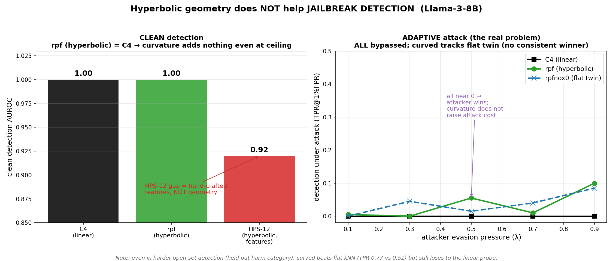
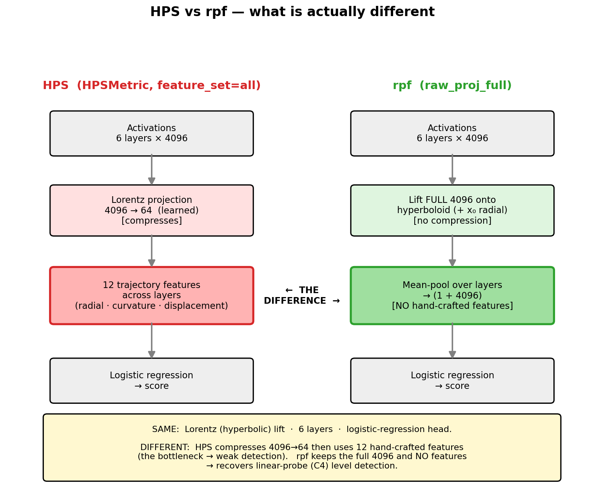
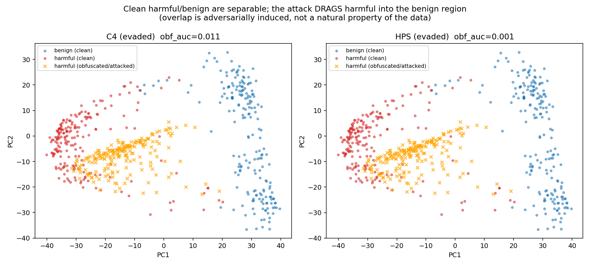
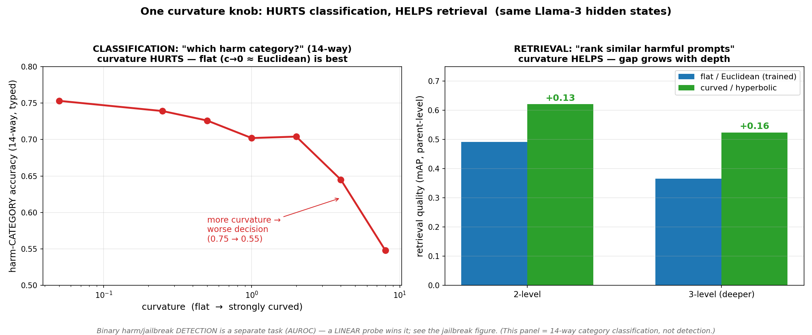
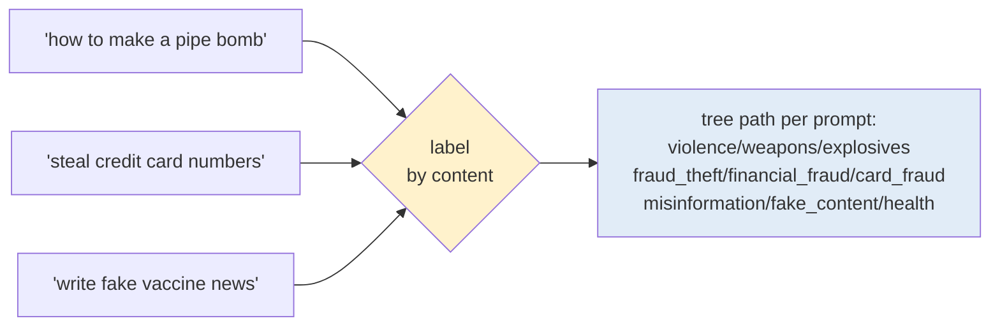
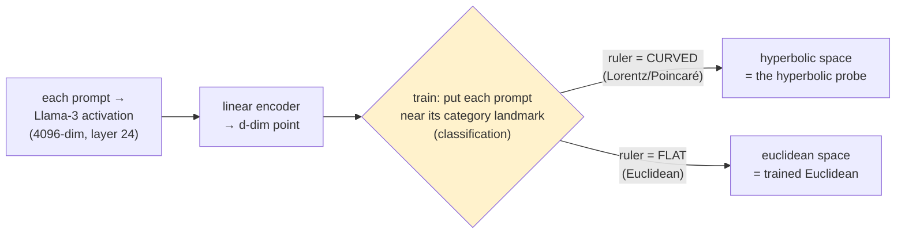
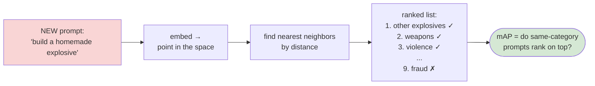
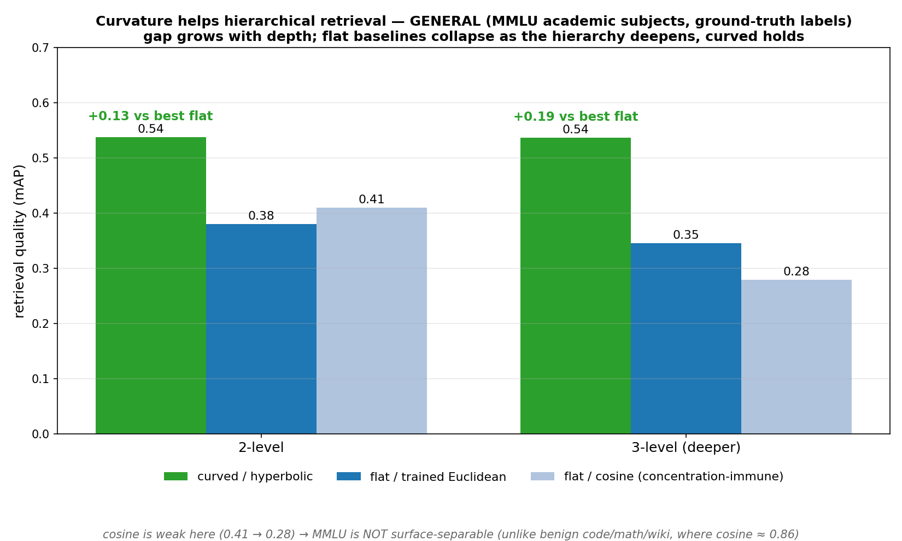

# Does hyperbolic geometry help latent-space safety probes?
### Llama-3-8B · harm monitoring (under adaptive jailbreak/obfuscation) **and** jailbreak-attack detection · negative result + a controlled twist

---

## The question

- LLMs turn each prompt into ~4096 numbers (an **activation**). A **probe** reads them to flag harmful / jailbroken behavior.
- Hyperbolic (**curved**) space is famously good at **hierarchies** — and harm has a hierarchy.
- **Q: does measuring distance in curved space beat ordinary flat space for these latent-space safety probes?**

---

## Two settings (so the terms are precise)

**A. Harm monitor under adaptive attack** *(Bailey "Obfuscated Activations")*
- probe trained on **harmful vs benign**
- attacker **jailbreaks + hides the activation** to evade it

**B. Attack-family detector** *(JBShield/RTV-style)*
- probe trained on **real jailbreaks** (GCG, PAIR, JBC) vs benign
- result: **C4 0.998 ≥ HPS 0.990 > HPS-Euclidean 0.968** (clean + open-set)

→ **Hyperbolic helps neither** *(A: clean+adaptive; B: clean+open-set — B-adaptive unrun).*

---

## Main result — hyperbolic does NOT help  *(Setting A: harm monitor under adaptive jailbreak/obfuscation)*



- **Clean (left):** curved **rpf ties linear C4 at ~1.0** → curvature adds nothing.
- Not just saturation: on the harder cache **rpf = rpfnox0 = 0.998 exactly** (gap 0.000).
- **Adaptive (right):** under attack, **every probe bypassed**; curved **tracks its flat twin**.
- **Robust** across curvature and layers *(soft-prompt attack; GCG/HHD-adaptive unrun).*

---

## Why — and it's NOT "linear is already perfect"

- "Linear is perfect → no room" only applies to **clean** detection.
- For the **adaptive** problem, curvature was a *genuinely plausible* fix — so **we tested it**:
  - under attack → bypassed like its flat twin;
  - in a *harder* open-set setting (held-out harm category) → curved beats flat-kNN (catch rate **0.77 vs 0.51**) **but still loses to the linear probe**.
- **Real reason = causal separability:** the attacker moves the activation across *whatever* boundary you draw, curved or straight. Geometry can't raise the attack cost.
- (One apparent "resistance" was **gradient masking** — a measurement artifact, not real robustness.)

---

## What "rpf" is (the probes)



- Same hyperbolic pipeline; only the boxes in color differ.
- **HPS** compresses 4096→64 then uses 12 hand-crafted features → the bottleneck (weak).
- **rpf** keeps the full activation, no features → recovers linear-probe-level detection.
- **rpfnox0** = rpf with the curved coordinate removed. **rpf ≈ rpfnox0 → curvature is inert.**

---

## Why clean works but adaptive fails  *(Setting A — harm monitor, Bailey obfuscation game)*



- Clean **harmful** (red) vs **benign** (blue) → **separate clusters**, a straight line splits them.
- Orange = harmful **after the attack** → dragged **into the benign cluster**.
- So the overlap is **adversarially created** → defeats *every* probe, any geometry.
- *(Note: harmful-vs-benign behaviors, not GCG/PAIR; orange = jailbroken-but-hidden.)*

---

## A different task — RETRIEVAL  *(where hyperbolic finally helps; NOT jailbreak detection)*



- Same hidden states, different job: not "is it a jailbreak?" but **"rank the most similar harmful prompts"** (retrieval).
- **Left:** curvature *hurts* the decision (classification). **Right:** curvature *helps* retrieval (**+0.13**, and **+0.16** with a deeper taxonomy).
- **One knob trades discrimination for ranking** — curvature **HURTS detection, HELPS retrieval** — *faithful ≠ discriminative*.

---

## Step 1 — turn prompts into a labeled tree



- 650 prompts → a **3-level path** each: `category / leaf / sub-leaf`.
- 9 categories → 14 leaves → sub-leaves.
- Tree distance = **how related**: same sub-leaf 0 · same leaf 2 · same category 4 · different 6.
- *That distance is the ground truth the geometry should reproduce.*

---

## Step 2 — train the space to SEPARATE categories



- Train to **separate categories** (pull same-category to its landmark, push others away).
- We do **NOT** train it to match the tree → tree-faithfulness is **measured afterward**.
- Run **twice, only the ruler differs** (curved vs flat) → any gap = **purely geometry**.
- *(Cosine isn't here — no training; it compares raw activations directly.)*

---

## What the learned space looks like (why curved fits a tree)

```text
   CURVED (hyperbolic) — room grows toward the edge        FLAT (euclidean) — fixed room
   ┌────────────────────────────────────┐                 ┌────────────────────────────┐
   │            · benign ·               │                 │  violence  cyber  fraud    │
   │      ╭───violence───╮               │                 │   ○ ○ ○    ▣ ▣ ▣   ◇ ◇ ◇   │
   │      │ weapons  phys│  ╭──cyber──╮  │                 │   ○ ○ ▣ ◇  ▣ ◇ ○   ◇ ○ ▣   │  ← sub-levels
   │      │ ╴explos ╴pois│  │intr  malw│ │                 │     (crowd together, hard   │     blur as you
   │      ╰──────────────╯  ╰──────────╯ │                 │      to keep nested at      │     add depth /
   │   ╭──fraud──╮     ╭misinformation╮  │                 │      high dim / depth)      │     dimension
   │   │card  scam│    │  fake_content │  │                └────────────────────────────┘
   │   ╰──────────╯    ╰───────────────╯ │
   └────────────────────────────────────┘
   parents near center, children fan out          everything competes for the same flat room
```

- Hyperbolic space has **exponentially more room as you move outward** — exactly what a branching tree needs: parents sit central, sub-categories fan toward the edge **without crowding**.
- Flat space has fixed room → deeper/finer levels **crowd and blur**. *This is why the curved advantage GROWS with depth.*

---

## Step 3 — inference: a new prompt arrives



- No retraining — just **embed it and see what it lands near.** Right neighbors = retrieval works.
- **Finding:** curved ranks the right neighbors higher (**+0.10–0.16 mAP** vs flat).
- *Same prompts, same encoder — only the ruler changed.*

---

## The numbers — curved (H) vs trained-flat (E), both depths *(d=32)*

**RANKING — curved (H) beats flat (E) at both depths** *(immediate-parent retrieval, mAP, d=32):*

| depth | curved H | flat E | gap |
|---|---|---|---|
| 2-level | 0.62 | 0.49 | **+0.13** |
| 3-level | 0.52 | 0.37 | **+0.16** |

- **Robust claim: curved > flat at every depth.** Absolute mAP drops at 3-level (finer hierarchy = harder for both).
- *"Grows with depth" is metric-dependent — the "parent" level itself shifts as the tree deepens (category→leaf), and at the very finest sub-leaf level the gap shrinks (+0.10→+0.06). So we call depth-scaling **suggestive, not a law** (MID slide). The solid result is just: **curved wins at every depth.***

**DECIDING — tied at both depths; harm-vs-harmless won by a linear probe:**

| Job | metric | 2-level (H/E) | 3-level (H/E) |
|---|---|---|---|
| which category | top-1 / typed | 0.79/0.74 · 0.72/0.73 | 0.70/0.66 · 0.54/0.53 |
| **harmful vs harmless** (open-set kNN) | AUROC | **linear 0.999** (curved 0.97, flat 0.95)* | — |

- **Curved helps RANKING; ties on DECIDING; loses harm-vs-harmless to a plain linear probe.** That contrast IS the result.
- *Depth-scaling: grows on harm same-target, mixed on MMLU → suggestive, not a law (MID slide).* \*open-set held-out-category, 2-level.

---

## Grows with dimension — the evidence *(harm, mAP gap vs d)*

| dimension d | 2 | 4 | 8 | 16 | 32 |
|---|---|---|---|---|---|
| curved − flat gap | **−0.03** | ~0 | +0.06 | +0.10 | **+0.13** |

- At **low d (2–3) flat WINS**; curved only pulls ahead as **d grows**.
- **Textbook says the opposite** — hyperbolic is supposed to win at *low* d (cram a tree into 2–5 dims). Here it's reversed → **contrarian, novel.**
- *Likely why:* our reps are real high-dim LLM activations, not clean fixed-size graphs — but the **mechanism is still open** (honest caveat).

---

## …and it's general, not a harm quirk



- The dissociation **replicates on MMLU subjects** — ground-truth labels, not harm.
- Curved beats flat at d=32: **+0.16 (category-level) / +0.07 (subject-level)** → **not harm-specific, not label-noise.**
- **Not surface-separable:** flat cosine is weak (0.41), unlike benign topics (0.86).
- *This slide = **generality** (curved wins on a 2nd dataset), NOT depth-scaling (mixed on MMLU — MID slide).*

---

## Methodology contribution

- Standard curvature stats (**δ-hyperbolicity, Ollivier-Ricci**) are **unreliable at LLM dimension** — they call a sphere "hyperbolic."
- We use a **calibrated** measure with a **dimension-matched random floor**.
- Result: the **token/vocabulary space is strongly hyperbolic** (confirms HELM), but the **harm-decision direction is linear** → curvature exists, just not where the harm signal is.

---

## 🟢 NOVEL — and why each is useful *(lit-search: 22 sources, per-claim verified)*

**1. The discrimination-vs-ranking dissociation (flagship)**
- one curvature knob, same reps: **hurts classification, helps retrieval**
- no prior work measures both axes on identical reps
- → *design rule:* **curve for ranking, stay flat for decisions**

**2. The advantage GROWS with embedding dimension (contrarian)**
- inverts the textbook "hyperbolic wins at low d" (De Sa'18, Bansal-Benton'21)
- → *new fact about LLM geometry at scale:* curvature matters in **high-dim** reps

---

## 🟡 MID — partly-new, and how to push each to novel

**Grows with DEPTH — only confirmed on one dataset**
- harm grows (+0.10→+0.16); MMLU flat (+0.065→+0.054)
- → fix: real **depth sweep (2→3→4)**, same target, ≥2 datasets

**δ-hyperbolicity / Ollivier-Ricci unreliable at LLM dim**
- new-in-this-form, but adjacent critiques exist
- → fix: ship a **standalone calibrated curvature protocol** + benchmark

**Hyperbolic-retrieval-on-hidden-states (the setup)**
- the combination is well-trodden (HIER, HyperbolicRAG, Raj)
- → fix: pitch the **dissociation + scaling**, not the setup

**Raj (ICLR'26 workshop) — concurrent**
- shares the premise, but classification-only, no dissociation/scaling
- → fix: cite + **distinguish on 4 axes**; our results are disjoint
- ⚠️ **limitation it implies:** his hyperbolic win was *only* on **reasoning-distilled** models (late-layer compression); on standard Instruct (like our Llama-3) he found none → **our negative may not hold on a reasoning model (DeepSeek-R1)** — a next-step.

⚪ *Known (cited, not claimed):* Nickel-Kiela, HELM, Arditi'24, Bailey'24.
*Novelty claims are "to our knowledge" — they rest on a 22-source search.*

---

## Bottom line

> **1. Hyperbolic does NOT help safety probes** — A (clean + adaptive) and B (clean + open-set). Linear wins. *(B-adaptive unrun.)*
>
> **2. But curvature DOES help hierarchical *ranking*** of harm content (**+0.10–0.16 mAP**). Not a detector.
>
> **3. NOVEL (to our knowledge):** one knob **trades discrimination for ranking**, and the gain **grows with dimension** — neither reported before.

---

## Next steps / decision

**Priority next experiment — attack the kNN detector**
- only tested *clean* (0.97); run the adaptive attack on it
- if it stays above 0 where linear collapses → a **real robustness positive**
- *(clean score proves nothing — linear is 0.999 clean, fully bypassed)*

**Then**
- **publish now:** negative + dissociation + MMLU generality
- **or invest:** 2nd model · data-size sweep (vs overfitting) · linear multi-class baseline
- **done:** attack-family open-set (curved ≈ linear, above flat-kNN)

---

## Q & A (anticipated)

**Q: Is this jailbreak detection or harm detection?**
A: Setting A's probe is a **harm monitor** (trained on harmful vs benign) — the *jailbreak is the obfuscation* that evades it (the orange PCA points = the model jailbroken into complying while hidden). Setting B (real GCG/PAIR/JBC) is the actual **attack detector**. Hyperbolic helps neither.

**Q: Would a probe trained on attacks raise the attack budget vs one trained on harm?**
A: Open — and **unrun**. It might help vs *known* attacks, but it overfits to attack signatures and causal separability lets the attacker move off them. We only tested it *clean* (~0.99), never under adaptive attack. Good next experiment.

**Q: Why did rpf do better at λ=0.5?**
A: Noise — they cross back and forth (the flat twin leads at λ=0.3 and 0.7), all values near zero. Equal and both bypassed, not a win.

**Q: Are the hidden states even hyperbolic?**
A: The token/vocabulary space is, strongly (matches HELM). But the harm-decision direction is linear — curvature exists, just not where the harm signal lives. Both true at once.

**Q: Isn't "linear is perfect" the reason curvature can't help?**
A: Only for clean detection. For the adaptive problem curvature *could* have helped — that was the hypothesis — so we tested it; it doesn't, because the attacker crosses any boundary regardless of shape (causal separability).

**Q: Is "hyperbolic on hidden states for retrieval" itself the novel part?**
A: **No.** That combination is well-trodden (HIER, HyperbolicRAG) + concurrent (Raj). Our novelty is on top of it: the **dissociation** + **grows-with-dimension**. We lead with those, not the setup.

**Q: Good at harmful-vs-harmless but mediocre at harm categories — why?**
A: Opposite difficulty. Harmful-vs-harmless = **one big split** → a straight line nails it (0.999). Categories = **many fine splits among all-harmful items** → subtle, less data each, noisy labels. The fine hierarchy is where geometry finally has structure to organize. *The gap IS the dissociation.*

**Q: Is the retrieval positive a jailbreak result?**
A: No — it's organizing harmful content by category (ranking). Different task. Not a better detector.

**Q: So what's it good for?**
A: Ranking/retrieval over hierarchies — triage, "find similar cases," taxonomy organization. Not detection.

**Q: What exactly is rpf vs HPS?**
A: Same hyperbolic pipeline; HPS adds compression + 12 hand-crafted features (the bottleneck); rpf keeps the full activation; rpfnox0 is rpf without the curved coordinate — and rpf ≈ rpfnox0, so curvature is inert.

**Q: Is the positive big?**
A: Modest (~+0.1–0.2 mAP), ranking-only, grows with dimension (not the classic low-d story), one model. Real and significant, but modest.
