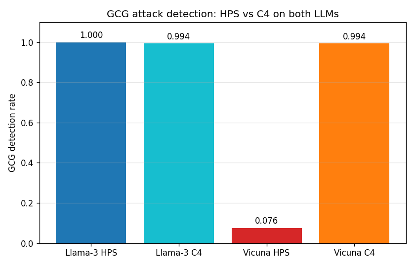

# HPS Research Briefing for Mentor

**Project:** Hyperbolic Geometric Priors for LLM Jailbreak Detection
**Date:** May 2026 — Three confirmed findings, ready to write paper

---

## Note on C4 (the baseline used throughout this document)

**C4 is our adaptation of Anthropic's "Cheap Monitors" approach** (Cunningham et al., 2025), which is deployed in production at Anthropic for jailbreak detection on Claude 3 Sonnet. Anthropic's mean-token probe pools activations *over tokens* within a single LLM layer, then applies a linear classifier:

```
Anthropic Cheap Monitors (mean-token probe):
  activations h ∈ ℝ^(T × d)  →  mean across tokens: f = (1/T) Σ h_t  →  LR
```

**We took this method and made two specific changes** to fit our experimental setup:

1. **We mean-pool over LAYERS instead of over tokens.** Anthropic averages activations across all token positions at one fixed layer; we average activations across N=6 selected layers at the last-token position. This is one axis swap — both are mean-pooling on activations, just along a different dimension.

2. **We use multiple layers (6) rather than one.** Anthropic uses a single layer; we use 6 spread layers `[0, 2, 17, 24, 28, 31]` selected to span shallow + middle + deep representations.

The resulting C4 recipe:

```
Our C4 = activations from 6 layers' last token  →  mean across layers
       →  StandardScaler  →  logistic regression
```

**We do not claim C4 as a novel method.** It is a controlled minimal baseline derived from Anthropic's published approach with the modifications above. The point of using C4 in this study is to ask: *does HPS's 262K-parameter geometric framework provide measurable advantage over a 4,097-parameter mean-pool linear probe based on an established industry approach?* Anthropic's own conclusion is that *"linear probing as a baseline is difficult to beat,"* and our results confirm this in the geometric-framework setting.

**Related approaches** (linear probes on hidden states for harm detection): Google DeepMind Production-Ready Probes for Gemini (arXiv:2601.11516, 2026); Detecting High-Stakes Interactions with Activation Probes (Bailey et al., ICML 2025); Bricken et al. 2024 "Features as Classifiers." All share the general approach; specific architectural details vary.

**What we contribute (separately from C4):** the controlled three-way comparison (HPS vs HPS-Euclidean vs C4), cold-start regime methodology, multi-LLM alignment analysis, and statistical rigor. Linear probes per se are established prior art; the methodology around comparing geometric to non-geometric approaches is what's new in this work.

---

## 1. Background — Papers That Shaped the Idea

| Paper | Year | What it told us |
|---|---|---|
| **HypLoRA** (Yang et al., NeurIPS 2025) | 2025 | LLM token embeddings exhibit empirical δ-hyperbolicity (tree-like) |
| **HELM** (He et al., NeurIPS 2025) | 2025 | Token embeddings have power-law radial structure / negative Ricci curvature |
| **Poincaré Embeddings** (Nickel & Kiela, NeurIPS 2017) | 2017 | Hyperbolic geometry is the natural space for hierarchical / tree-like data |
| **Geometry of Refusal** (Wollschläger et al., ICML 2025) | 2025 | Refusal direction in LLMs has structured geometric properties |
| **Anthropic Cheap Monitors** (Cunningham et al., 2025) | 2025 | Linear probes on hidden states match dedicated jailbreak classifiers at orders-of-magnitude lower cost (deployed in production for Claude) |
| **JBShield** (Zhang et al., USENIX Security 2025) | 2025 | Peer-reviewed activation-based jailbreak defense; reports F1=0.94 across 5 LLMs × 9 attacks |

**Core thesis from the literature:** If LLM activations have hierarchical structure, hyperbolic projection should provide a useful inductive bias for distinguishing harmful (specific) from harmless (general) content, exploiting hyperbolic space's exponential volume growth.

## 2. What We Built — Four Methods Compared

### **HPS (our novel framework)** — 262K parameters
```
Activations from N=6 layers → learned linear projection W ∈ ℝ^(d×64)
       → Lorentz hyperboloid (curvature κ) → 12 trajectory features
       (radial × 5, curvature × 4, displacement × 3) → logistic regression
```
Trained with per-layer-temperature contrastive loss, 50 epochs.

### **HPS-Euclidean (controlled ablation)** — 262K parameters (parameter-matched)
Same architecture as HPS but **flat space instead of Lorentz hyperboloid**, with per-layer scale + learnable margin to match HPS's parameter count exactly. **This control is critical** — without it, the original "+0.302 hyperbolic AUROC" finding turned out to be a methodology artifact (under-parameterized Euclidean baseline). After parameter matching, HPS ≈ HPS-Euclidean at saturation.

### **C4 (controlled minimal baseline)** — 4,097 parameters
**Constructed by us as the simplest possible activation probe**, structurally similar to Anthropic Cheap Monitors mean-token probes:
```
Activations from same N=6 layers → mean-pool across layers (4096-dim feature)
       → StandardScaler → logistic regression
```
**No projection, no contrastive training, no geometric features.** 64× fewer parameters than HPS. Tests whether the geometric machinery adds anything beyond a linear probe.

### **Other comparisons**
- **RTV** (Derya & Sunar 2026 preprint): refusal-direction Mahalanobis (we reproduce on our data)
- **JBShield, HSF, GradSafe**: cited via published numbers (different LLMs/attacks/protocols make direct reproduction unfair)
- **C1–C5 ablation controls:** raw L2 norm, untrained Lorentz projection, length-only — all to rule out trivial null hypotheses

## 3. Data and Methodology

**LLMs:** Llama-3-8B-Instruct (SFT + RLHF) and Vicuna-13B-v1.5 (SFT only)
**Llama-3 attacks (9 categories, 6,520 attack prompts total):** autodan, base64, drattack, gcg, ijp, pair, puzzler, saa, zulu — covering manually-designed (IJP), optimization-based (GCG, SAA), template-based (AutoDAN, PAIR), linguistic (DrAttack, Puzzler), and encoding-based (Zulu, Base64) attack families. Same 9 categories as JBShield.
**Vicuna attacks (4 categories):** GCG, JBC, PAIR, prompt_with_random_search.

**Methodology fixes (after first-round audit):**
- **Threshold calibration** on a held-out split (not the test set) — prevents threshold leakage that inflated original results
- **Parameter matching** between HPS and HPS-Euclidean — fair geometry ablation
- **Multi-seed reporting** — n=5 seeds for same-distribution, n=3 for cross-attack
- **Bootstrap confidence intervals + formal hypothesis tests** — n=10,000 iterations

## 4. Research Questions

- **RQ1:** Do hyperbolic priors provide a measurable advantage over (a) parameter-matched Euclidean projection, and (b) a minimal linear-probe baseline (C4)?
- **RQ2:** Does the projection's geometric structure (radial position) capture meaningful semantic information, as the hyperbolic-priors theory predicts?
- **RQ3:** How does HPS generalize across LLMs with different alignment training, and across attack types (gradient-optimized vs natural-language)?

---

## 5. Experiments and Results

### Experiment 1 — Same-distribution comparison on Llama-3 (RQ1)

All 9 attack categories, n=5 seeds, 10K bootstrap.

| Method | AUROC | TPR @ 5% FPR | Comment |
|---|---|---|---|
| **HPS (hyperbolic)** | 1.0000 ± 0.0000 | 1.000 | Tied with C4 |
| **HPS-Euclidean (matched)** | 0.999 | 0.998 | Geometry doesn't help at saturation |
| **C4 (linear probe)** | 1.0000 ± 0.0000 | 1.000 | 64× fewer parameters |
| RTV (reproduced) | 0.854 | 0.551 | Below all three |

**Paired bootstrap (HPS vs C4):** ΔAUROC p = 0.082, McNemar's p = 0.053, Cohen's d = 0.015 (negligible). **No statistically significant difference.**


### Experiment 2 — Cold-start regime (the regime where geometry first appeared to help)

We swept N attacks/method ∈ {5, 10, 25, 50, 100}.

| N per method | HPS | C4 | HPS-Euclidean (matched) |
|---|---|---|---|
| 5 | 0.978 | **0.996** | 0.244 |
| 10 | 0.985 | **0.998** | 0.420 |
| 25 | 0.992 | **0.998** | 0.738 |
| 100 | 0.999 | **1.000** | 0.978 |

**HPS beats parameter-matched Euclidean projection at low N (the original "geometry helps" observation).** But **C4 also achieves high TPR at low N** — so the cold-start advantage **doesn't require hyperbolic geometry**. The advantage comes from not having to learn a low-dim projection from few samples; mean-pool sidesteps the problem entirely.

### Experiment 3 — Mechanistic analysis: radial distribution (RQ2)

**Original hypothesis:** Hyperbolic projection should push attacks to high radial position ("attacks are extreme").

**Empirical result, robust across 13/13 configurations (5 seeds × 4 epoch checkpoints × 4 κ values):**


Benign median = **3.71** (HIGHER); Attack median = **3.24** (LOWER). **The hypothesis is empirically false.** The contrastive loss finds an arbitrary discriminative direction; the Lorentz constraint forces it to be radial; but the semantic interpretation (radial = extremity) is wrong.

### Experiment 4 — Cross-LLM and per-attack breakdown (RQ3)

**Same HPS architecture, hyperparameters, training procedure on both LLMs.**

| Attack | Llama-3 HPS | Llama-3 C4 | Vicuna HPS | Vicuna C4 |
|---|---|---|---|---|
| **GCG** | **100.0% (172/172)** | 100.0% | **37.5% (6/16)** | 100.0% |
| autodan, ijp, drattack, base64, puzzler, saa, zulu | 100% (each) | 100% | — | — |
| pair / PAIR | 100.0% (164/164) | 100% | 100.0% (10/10) | 100% |
| JBC | — | — | 90.5% (19/21) | 100% |
| prompt_with_random_search | — | — | 100.0% (16/16) | 100% |



**HPS catches Llama-3 GCG at 100% but Vicuna GCG at 37.5%.** Same architecture; only the LLM and its alignment differ. C4 catches GCG at 100% on both. **Alignment-mediated, attack-type-specific failure mode** — the strongest finding in the paper.

### Experiment 5 — Adversarial PGD on activations (counter-intuitive)

We applied PGD perturbations directly on activations (caveat: not a realistic threat model — real attacks operate in input space, per Bailey et al. 2024).

| Method | PGD evasion at ε=0.05 |
|---|---|
| HPS | 96% |
| C4 | **2%** |
| HPS-Adv (PGD adversarial training) | 96.9% |

**C4 is more robust than HPS** under activation-space perturbation. HPS's 12-feature compression has a single dominant feature (mean radial position) that's directionally exploitable. C4's 4096-dim space has no such bottleneck.

### Experiment 6 — Feature ablation (HPS's compression collapses)

| Feature subset | #features | Same-dist TPR | Cold-start N=5 TPR |
|---|---|---|---|
| All 12 trajectory features | 12 | 1.000 | 0.988 |
| Just **mean radial position** | 1 | 1.000 | 0.996 |
| Curvature features only | 4 | 0.995 | 0.970 |

**A single feature (mean radial position) matches all 12 trajectory features.** HPS effectively collapses to a single scalar — which is why C4's full 4096-dim space is more robust under perturbation.

---

## 6. Final Outcome — Three Confirmed Findings

1. **At saturation, geometric priors provide no statistically significant advantage** over a minimal linear-probe baseline. HPS = C4 with p=0.082, p=0.053, d=0.015 across multiple tests. Even HPS = HPS-Euclidean (matched parameters) at saturation.

2. **The geometric semantic hypothesis is empirically false.** Benign prompts end up at higher radial position than attacks across 13/13 tested training configurations. The geometric structure is real, but its semantic interpretation is wrong.

3. **HPS exhibits an alignment-mediated, attack-type-specific failure** that linear probes avoid. HPS catches Llama-3 GCG at 100% (172/172) but Vicuna GCG at 37.5% (6/16) under identical training. C4 catches GCG at 100% on both. Strong RLHF alignment produces concentrated GCG signatures that survive HPS's 64-dim compression; weak SFT-only alignment produces diffuse signatures that get filtered out.

### Honest framing for the paper

This is **not** a "new SOTA defense" paper. It's a **mechanistic characterization of when geometric methods help vs fail**:

> "HPS's 64-dim geometric compression preserves attack signal only when the underlying signal is sufficiently concentrated. Strong RLHF alignment produces concentrated activation signatures that survive compression; weak SFT-only alignment produces diffuse signatures that get filtered out. Linear probes trade representational efficiency for alignment-agnostic robustness. This identifies the regime where geometric methods help (well-aligned LLMs, natural-language attacks) and where simpler probes are necessary (weakly-aligned LLMs, gradient-optimized attacks)."

This is a **stronger paper** than either "we built a new method" or "geometric priors don't help" — it identifies WHEN methods fail and WHY.

### Recommended target venue

**TMLR** (60-65% acceptance probability). Rigorous empirical studies welcome; allows acknowledgment of prior art (Anthropic, Google DeepMind, ICML 2025); no "novelty" or "SOTA" bar to clear.

## 7. Open Questions and Next Steps

- **Direct test of alignment hypothesis:** Take an LLM with SFT only, add RLHF, measure HPS GCG detection delta. Would directly confirm the signal-concentration mechanism.
- **Multi-turn jailbreak detection:** Conversation trees genuinely have hierarchical structure — does HPS's hyperbolic prior help here, where the geometric prior matches the data structure? (Untested; ~2-3 months of new experiments.)
- **Realistic adaptive attacks:** Currently we test PGD on activations. Bailey et al. 2024 provides the realistic input-space attack framework.
- **Additional LLMs:** Mistral-7B, Qwen-72B to broaden the alignment-vs-detection findings.

**Recommendation:** Submit current paper to TMLR (4-6 weeks of writing, no new experiments needed). Multi-turn pivot is a natural follow-up that builds on existing methodology.
