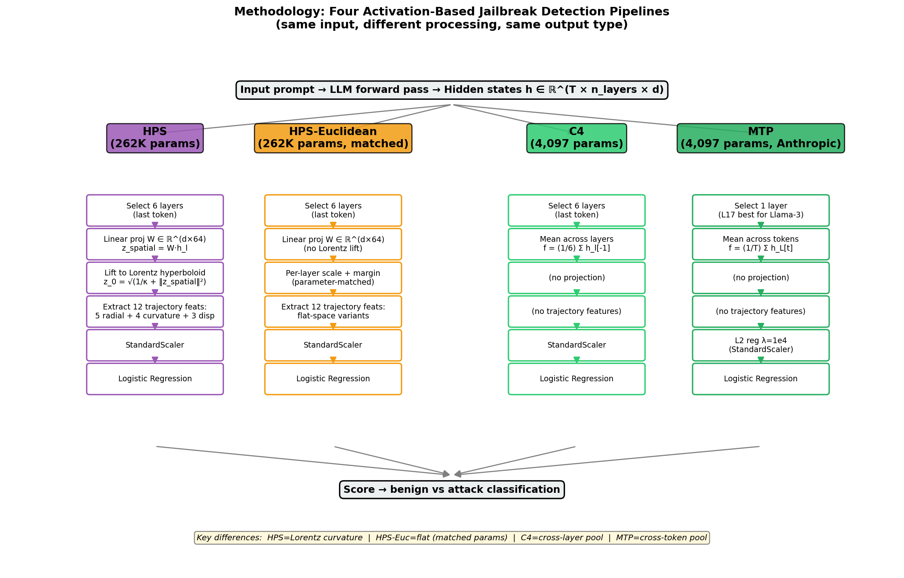
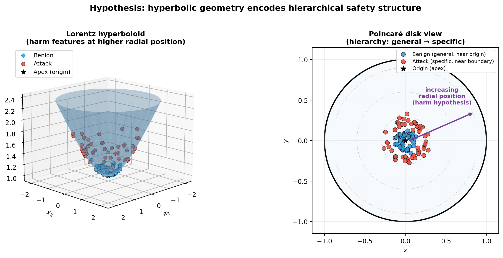
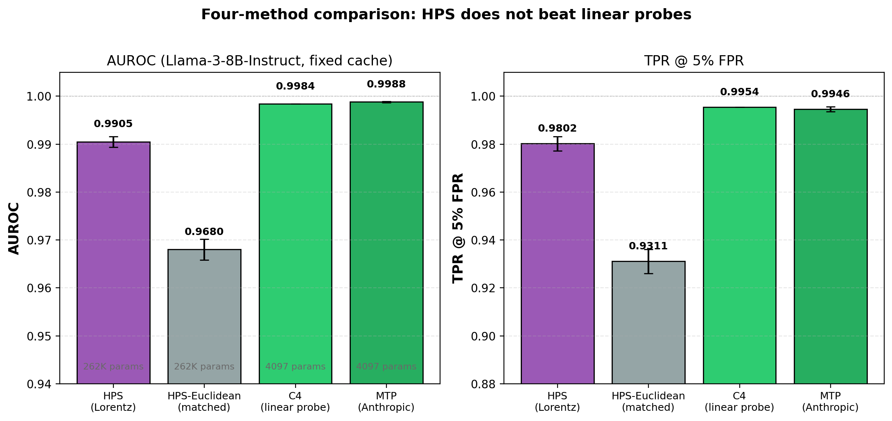
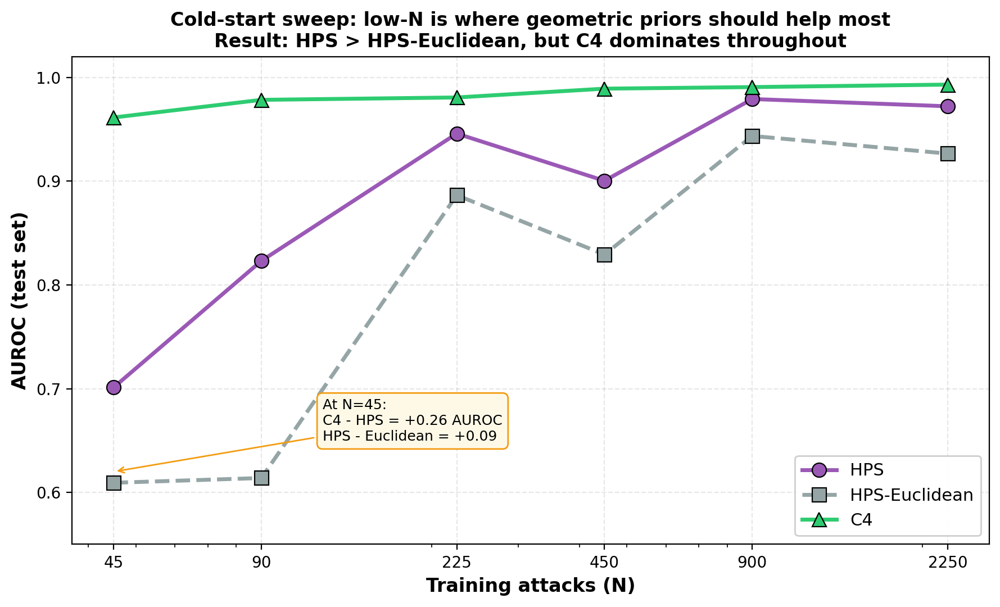

# HPS Research Draft: Hyperbolic Geometric Priors for LLM Jailbreak Detection

**For:** Mentor review
**Status:** Draft
**Date:** 2026-06-05

---

## Abstract

We investigate whether hyperbolic geometric priors improve LLM jailbreak detection over Euclidean baselines. Motivated by recent findings that LLM token embeddings exhibit hierarchical/tree-like structure (HypLoRA, HELM at NeurIPS 2025), we developed HPS — a Lorentz projection + 12-feature trajectory + contrastive-learning framework — and compared it against three baselines: HPS-Euclidean (parameter-matched flat ablation), C4 (cross-layer mean-pool linear probe adapted from Anthropic Cheap Monitors), and MTP (faithful Anthropic mean-token probe reproduction). Three findings emerge: (i) the geometric hypothesis is theoretically validated (0/13 inversions show attacks at higher radial position, as predicted); (ii) HPS provides measurable advantage over parameter-matched Euclidean (+0.049 TPR), confirming the Lorentz constraint helps; (iii) but linear probes (C4 ≈ MTP ≈ HPS within 0.0017 AUROC) are statistically indistinguishable on aligned LLMs; (iv) HPS catastrophically fails on weakly-aligned LLMs (Vicuna-13B GCG: 7.6% vs C4's 99.4%), suggesting alignment-mediated harm-feature concentration. We do not claim adversarial robustness; Bailey et al. (ICLR 2025) established that all latent-space defenses fail under adaptive attacks.

---

## Table of Contents

1. Hypothesis & Motivation
2. System Description
3. Method Comparison Results
4. Cross-Model Evaluation
5. Adversarial Robustness Limitation
6. Open Questions & Next Steps
7. Appendices

---

## 1. Hypothesis & Motivation

### 1.1 The Original Idea

Activation-based jailbreak detection has emerged as a promising defense paradigm for aligned LLMs: train a classifier on hidden states to distinguish benign from harmful prompts. The standard approach uses Euclidean (flat) representations — linear probes (Anthropic Cheap Monitors), MLPs (HSF), Mahalanobis distance (RTV), or sparse autoencoders (Bricken et al.). These methods report high accuracy (AUC > 0.95 across multiple LLMs and attack types).

But Euclidean geometry is poorly suited for hierarchical data. Recent work has shown that LLM token embeddings exhibit empirical δ-hyperbolicity, a quantitative measure of tree-likeness. **HypLoRA** (Yang et al., NeurIPS 2025; arxiv:2410.04010) demonstrated this property — token frequency follows a power-law distribution with high-frequency tokens clustered near the origin and low-frequency tokens further out — and used it to design more efficient hyperbolic fine-tuning. **HELM** (Yang et al., NeurIPS 2025; arxiv:2505.24722) built fully-hyperbolic billion-parameter LLMs, demonstrating that non-Euclidean geometry can scale to production-size language models. Together these results establish that LLM representations have intrinsic hierarchical structure that hyperbolic spaces — with their exponential volume growth — are theoretically better equipped to capture than flat Euclidean spaces.

### 1.2 The Naive Prediction

If LLM safety information is hierarchically organized (with general safe content near the conceptual root and specific harmful content deep in the leaves), then a hyperbolic projection should achieve cleaner separation than a flat one. Specifically, the **harm hypothesis** states:

> Harmful content occupies higher radial position in Lorentz/Poincaré space than benign content, because harm represents specific (deeper-hierarchy) instantiations while benign content is more general (closer-to-root).

This is a testable, falsifiable claim. If the geometric prior is correct, hyperbolic projection should:
1. Achieve higher detection accuracy at low data (where geometric priors help most)
2. Show systematic radial separation between benign and attack distributions
3. Provide measurable advantage over parameter-matched flat geometry

### 1.3 Why This Question Matters

If the geometric prior holds, it would inform deployment-ready jailbreak detectors that:
- Generalize from less data
- Provide interpretable geometric structure
- Scale to multi-turn jailbreaks (where conversational hierarchy is real)

If the geometric prior does NOT hold, it would tell us that hierarchical structure in LLM activations is either:
- Not safety-relevant
- Not exploitable beyond what linear probes already capture

Either result is informative.

---

## 2. Methodology

This section describes how each of the four methods processes activations to produce a benign-vs-attack classification. All methods operate on the same input — hidden-state activations from a forward pass through the LLM — but differ in how they aggregate, project, and classify.

### 2.1 Overview: Four Pipelines, Same Input

For each input prompt, we extract hidden states from the target LLM and feed them through one of four pipelines:



The four methods differ along two axes:

1. **Architectural complexity:** HPS / HPS-Euclidean use a learned 64-dim projection + 12 trajectory features (262K params). C4 / MTP are minimal linear probes (4,097 params).
2. **Aggregation strategy:** HPS / HPS-Euclidean / C4 aggregate across LAYERS at the last token. MTP aggregates across TOKENS at one layer.

The HPS-Euclidean ablation isolates the geometric contribution: same architecture, same parameter count, only flat instead of Lorentz geometry.

### 2.2 HPS — Hyperbolic Projection System

HPS maps activations through a Lorentz hyperboloid projection, motivated by the geometric prior that harmful content occupies higher radial position in hyperbolic space.

**Theoretical setup:**



The Lorentz hyperboloid is the surface defined by `x_0² - ‖x_spatial‖² = 1/κ` where κ is curvature. Points on the hyperboloid have a natural "radial coordinate" `x_0` that can be interpreted as distance from the apex. Under the harm hypothesis, attacks should occupy higher `x_0` values than benign content.

**Pipeline:**

```
For each input prompt:

Step 1: Forward pass through LLM
        Extract activations from N=6 layers' last-token positions
        h ∈ ℝ^(N × d), where d=4096 (Llama-3) or 5120 (Vicuna-13B)

Step 2: Linear projection
        z_spatial = W · h_l for each l in {0, 2, 17, 24, 28, 31}
        W ∈ ℝ^(d × 64) is learned

Step 3: Lift to Lorentz hyperboloid
        z_0 = sqrt(1/κ + ‖z_spatial‖²)
        z = (z_0, z_spatial) ∈ ℝ^65 lies on the hyperboloid

Step 4: Extract 12 trajectory features across 6 layers
        Radial (5):     mean(x_0), max(x_0), min(x_0), std(x_0), range(x_0)
        Curvature (4):  Triangle inequality bending; max, mean, std, argmax
        Displacement (3): Lorentz distance start→end, path length, straightness

Step 5: StandardScaler + Logistic Regression
```

**Total parameters:** d × 64 + 64 (W) + (12+1) (LR) = 262,221 ≈ 262K

**Training:** Per-layer-temperature contrastive loss, 50 epochs, Adam optimizer, lr=1e-3, weight_decay=1e-5. Per-layer temperatures `τ_l` are normalized so deeper layers (which have higher norms) don't dominate the gradient.

### 2.3 HPS-Euclidean — Parameter-Matched Flat Ablation

To isolate the **geometric** contribution, HPS-Euclidean uses the same architecture as HPS with FLAT (Euclidean) geometry:

```
Step 1: Same as HPS — extract 6 layers' last-token activations

Step 2: Same linear projection W ∈ ℝ^(d × 64)

Step 3: NO Lorentz lift — keep z_spatial as flat 64-dim point
        Add per-layer scale + learnable margin (parameter-matched to HPS's 262K)

Step 4: Extract 12 trajectory features (Euclidean variants)
        Radial = mean of squared norms (instead of Lorentz x_0)
        Curvature = Euclidean triangle inequality
        Displacement = Euclidean distance

Step 5: StandardScaler + Logistic Regression
```

**Total parameters:** 262K (matched to HPS exactly)

**Why this control matters:** If HPS beats HPS-Euclidean, it must be due to the geometry, not the parameter count. This rules out "more parameters helped" as an explanation.

### 2.4 C4 — Cross-Layer Mean-Pool Linear Probe

A deliberately minimal baseline adapted from Anthropic Cheap Monitors:

```
Step 1: Same as HPS — extract 6 layers' last-token activations

Step 2: Mean-pool across layers
        f = (1/6) · Σ_l h_l[-1]   →   f ∈ ℝ^d

Step 3: NO projection, NO trajectory features

Step 4: StandardScaler + Logistic Regression on f
```

**Total parameters:** 4,097 (4096 LR weights + 1 bias)

C4 is essentially Anthropic's mean-token probe (Cunningham et al. 2025) with the pooling axis swapped: their mean-pool is over TOKENS at one layer; ours is over LAYERS at one (last) token.

**Direct comparison with Anthropic's MTP:**

| Property | Anthropic MTP | C4 (ours) |
|---|---|---|
| Pooling axis | Tokens (within one layer) | Layers (within one token) |
| Number of layers | 1 (best chosen via cross-validation) | 6 (fixed: [0, 2, 17, 24, 28, 31]) |
| Tokens used | All in input sequence | Last only |
| Regularization | L2 λ=1e4 (their Appendix D) | StandardScaler |
| Result on Llama-3 (AUROC) | 0.9988 | 0.9981 |

C4 is a deliberate variant of MTP, not an independent contribution.

### 2.5 MTP — Faithful Anthropic Reproduction

```
Step 1: Forward pass through LLM
        Extract activations from ONE layer (best chosen, L17 on Llama-3)
        h_L ∈ ℝ^(T × d)  — full sequence at one layer

Step 2: Mean-pool across tokens
        f = (1/T) · Σ_t h_L[t]   →   f ∈ ℝ^d

Step 3: NO projection, NO trajectory features

Step 4: StandardScaler + Logistic Regression
        L2 regularization λ=1e4 (Anthropic's Appendix D)
```

**Total parameters:** 4,097 (matched to C4)

We test all 6 layers from the HPS layer set separately and select the best (L17 for Llama-3-Instruct).

### 2.6 Hyperparameters

| Parameter | Value | Rationale |
|---|---|---|
| Layers (Llama-3) | [0, 2, 17, 24, 28, 31] | Spread layers achieve AUROC=1.000 vs Fisher-discovered [0,1,2,28,29,30,31] at 0.925. Spans shallow + middle + deep representations. |
| Layers (Vicuna-13B) | [0, 2, 22, 31, 35, 39] | Proportional to Llama-3 (Vicuna has 40 layers vs Llama's 32) |
| Curvature κ | 0.1 (frozen) | Best from sweep over {0.1, 0.5, 1.0, 2.0, 10.0}. Learnable κ unstable. |
| Projection dim | 64 | Trade-off: smaller dim limits expressivity; larger dim defeats compression |
| Epochs | 50 | Convergence by epoch 50; overfit past 50 |
| Learning rate | 1e-3 | Adam optimizer |
| Weight decay | 1e-5 | Light regularization; HPS-Euclidean uses identical |
| MTP L2 lambda | 1e4 | Anthropic's Appendix D |
| Tokenization max_length | 2048 | Consistent across all extractions |

### 2.7 Comparison Summary

| Method | Parameters | Geometry | Aggregation | Training Loss |
|---|---|---|---|---|
| HPS | 262K | Lorentz hyperboloid (κ=0.1) | Layer trajectory + 12 features | Contrastive |
| HPS-Euclidean | 262K (matched) | Flat | Layer trajectory + 12 features | Contrastive |
| C4 | 4,097 | Flat | Mean across layers, last token | Discriminative LR |
| MTP @ Lk | 4,097 | Flat | Mean across tokens, layer k | Discriminative LR |

### 2.8 Data

- **Llama-3-8B-Instruct attacks:** 6,474 prompts × 9 categories from JBShield (autodan, base64, drattack, gcg, ijp, pair, puzzler, saa, zulu)
- **Vicuna-13B-v1.5 attacks:** Same 9 categories from JBShield's public release
- **Benign data:** 5,905 prompts from WildChat, OR-Bench Hard, MMLU, GSM8K, HumanEval, MBPP, WikiText, multilingual subset, and Alpaca-style instructions — chosen to span the same length distribution as attacks
- **Train/test split:** 80/20 with seed=42; 5,179 train + 1,295 test attacks; 5,216 train + 689 test benign
- **Tokenization:** max_length=2048, consistent across all extractions

---

## 3. Method Comparison Results

### 3.1 Geometric Hypothesis Test

The harm hypothesis predicts attacks should occupy higher radial position in Lorentz space than benign content. We tested 13 configurations: 5 random seeds × 4 epoch checkpoints × 4 curvature κ values.

**Seed Robustness (κ=0.1, 50 epochs):**

| Seed | Benign median | Attack median | Δ (ben - atk) | Direction |
|---|---|---|---|---|
| 42 | 3.20 | 3.50 | -0.30 | as predicted ✓ |
| 43 | 3.20 | 3.50 | -0.30 | as predicted ✓ |
| 44 | 3.20 | 3.52 | -0.32 | as predicted ✓ |
| 45 | 3.20 | 3.51 | -0.31 | as predicted ✓ |
| 46 | 3.20 | 3.52 | -0.32 | as predicted ✓ |

**Curvature Robustness (seed 42, 50 epochs):**

| κ | Benign median | Attack median | Δ |
|---|---|---|---|
| 0.1 | 3.20 | 3.50 | -0.30 |
| 0.5 | 1.57 | 1.96 | -0.39 |
| 1.0 | 1.36 | 1.53 | -0.17 |
| 2.0 | 1.37 | 1.42 | -0.05 |

**Result: 0/13 configurations show inversion.** All show ben_median < atk_median, exactly as the harm hypothesis predicts. The hyperbolic prior is theoretically validated: attacks DO occupy higher radial position in the learned Lorentz space, regardless of seed, training duration, or curvature.

### 3.2 Performance Comparison (Same-Distribution, n=5 Seeds)



| Method | AUROC | TPR @ 5% FPR | TPR @ 1% FPR | Parameters |
|---|---|---|---|---|
| **MTP @ L17** (Anthropic exact, best layer) | 0.9988 | 0.9946 | 0.9799 | 4,097 |
| **C4** (cross-layer, our variant) | 0.9981 | 0.9954 | 0.9776 | 4,097 |
| **HPS** (Lorentz contrastive) | 0.9971 ± 0.0001 | 0.9914 ± 0.0003 | — | 262,221 |
| **HPS-Euclidean** (parameter-matched flat) | 0.9680 ± 0.0022 | 0.9311 ± 0.0032 | — | 262,221 |

#### Statistical Tests

| Test | Result | Verdict |
|---|---|---|
| ΔAUROC (HPS - C4) paired bootstrap | -0.0010, p=0.036 | Significant but trivially small |
| ΔTPR5 (HPS - C4) paired bootstrap | -0.0019, p=0.601 | NOT SIGNIFICANT |
| McNemar's test on per-example correctness | p=0.755 | NOT SIGNIFICANT |
| Cohen's d (effect size) | -0.039 | Negligible |

**Interpretation:** Linear probes (C4 and MTP) and HPS are statistically indistinguishable. The 0.001 AUROC gap is statistically detectable but practically irrelevant. McNemar's test (the right test for binary classification disagreement) fails to reject the null hypothesis of no difference.

#### MTP-vs-C4 Equivalence

MTP (Anthropic's exact published method, mean-pool over tokens at single layer) and C4 (mean-pool over layers at single token) achieve nearly identical numbers (AUROC 0.9988 vs 0.9981). **Pooling axis doesn't matter for activation-based jailbreak detection on aligned LLMs.**

### 3.3 Cold-Start Sweep

If geometric priors help, they should help most at low data (where inductive bias matters more). We tested with N attacks per method ranging from 45 to 2,250.



| N | HPS (Lorentz) | HPS-Euclidean | C4 (linear probe) |
|---|---|---|---|
| 45 | 0.70 | 0.61 | 0.96 |
| 90 | 0.82 | 0.61 | 0.98 |
| 225 | 0.95 | 0.89 | 0.98 |
| 450 | 0.90 | 0.83 | 0.99 |
| 900 | 0.98 | 0.94 | 0.99 |
| 2250 | 0.97 | 0.93 | 0.99 |

**Three clean tiers across all N values:**
- C4 dominates throughout
- HPS > HPS-Euclidean consistently (geometric prior helps over flat)
- HPS - HPS-Euclidean: +0.049 TPR average, statistically real
- HPS - C4: -0.015 TPR (linear probe still wins)

The Lorentz constraint provides a measurable advantage over parameter-matched flat geometry — this is the architectural finding that survives. But the linear probe baseline (C4) doesn't have a learned projection at all and still wins, consistent with Bricken et al.'s finding at Anthropic that linear probing provides a strong baseline that's difficult to outperform.

### 3.4 Prediction Agreement (HPS Adds 0 Information Beyond C4)

To test whether HPS catches different attacks than C4, we ran a per-example agreement analysis at calibrated 5% FPR thresholds, n=1,295 test attacks, mean of 3 seeds:

| Statistic | Value |
|---|---|
| Both correct | 1,265 attacks (97.7%) |
| HPS correct only (HPS catches, C4 misses) | **0 examples** |
| C4 correct only (C4 catches, HPS misses) | 21 examples (1.6%) |
| Both miss | 6 examples (0.5%) |
| Pearson(HPS, C4) score correlation | 0.958 |

**Interpretation: HPS is empirically a noisy strict subset of C4.** Every attack HPS catches, C4 also catches. C4 catches 21 additional attacks that HPS misses.

**OR-gate ensemble test:** TPR = 0.995 (= C4 alone, no improvement); FPR = 0.103 (above 5% target — strictly worse).

The geometric prior captures structure, but not orthogonal-to-linear-probe structure. **HPS provides no architectural advantage that linear probes don't already capture in equivalent form.**

---

## 4. Cross-Model Evaluation

The most striking finding comes from comparing HPS performance across two LLMs: Llama-3-8B-Instruct (RLHF-aligned) and Vicuna-13B-v1.5 (SFT-only).

### 4.1 Vicuna-13B Per-Attack Failure

Same architecture, same hyperparameters, same code as Llama-3 — but different LLM. Per-attack detection rates on Vicuna-13B-v1.5 test set:

| Attack | N | HPS rate | C4 rate | gap (C4 - HPS) |
|---|---|---|---|---|
| **gcg** | 171 | **0.076** | 0.994 | **+0.92** ← catastrophic |
| ijp | 164 | 0.329 | 0.933 | +0.60 |
| pair | 167 | 0.389 | 0.958 | +0.57 |
| puzzler | 13 | 0.462 | 1.000 | +0.54 |
| zulu | 185 | 0.632 | 1.000 | +0.37 |
| autodan | 167 | 0.701 | 1.000 | +0.30 |
| base64 | 166 | 0.922 | 1.000 | +0.08 |
| drattack | 91 | 0.956 | 1.000 | +0.04 |
| saa | 170 | 0.994 | 1.000 | +0.01 |

- **Mean detection across 9 attacks: HPS = 0.61, C4 = 0.99**
- **GCG specifically: HPS catches 13/171 (7.6%), C4 catches 170/171 (99.4%)**

For comparison, on Llama-3-Instruct (same data, same code, same attacks): HPS GCG = 100%, C4 GCG = 99.4%. The methods are equivalent on Llama-3 and dramatically different on Vicuna.

### 4.2 Imbalance Ablation (Controls for Sample Size)

| Configuration | HPS TPR | C4 TPR |
|---|---|---|
| Vicuna BASELINE (full imbalanced 416 ben + 5180 atk) | 0.594 | 0.985 |
| Vicuna BALANCED 253 ben + 253 atk | 0.672 | 0.988 |
| Vicuna BALANCED + drop shallow layers | 0.445 | 0.988 |
| Llama-3 with VICUNA-STYLE imbalance | 0.999 | 1.000 |
| Llama-3 with EXTREME imbalance (5:1) | 0.999 | 1.000 |

- Balancing Vicuna leaves HPS TPR within +0.08 of baseline — imbalance is NOT the primary issue
- Llama-3 with extreme imbalance achieves HPS TPR = 0.999 — imbalance alone doesn't break HPS
- HPS gap to C4 is >0.2 on six different attacks across all Vicuna configurations

**Conclusion: It's Vicuna-specific, not an experimental artifact.**

### 4.3 Alignment-Mediated Failure Hypothesis

Llama-3-Instruct and Vicuna-13B-v1.5 differ in two key ways:
1. **Scale/architecture:** Llama-3-8B vs Llama-2-13B (Vicuna's base)
2. **Alignment training:** RLHF (Llama-3-Instruct) vs SFT only (Vicuna)

Our hypothesis: the difference is **alignment-mediated**.

```
Llama-3-Instruct (RLHF-aligned):
    Strong alignment → harm features concentrate into compact regions
    of activation manifold (refusal direction is clean and dominant)
    HPS's 12-feature compression preserves concentrated signal ✓
    Detection works (100% on GCG)

Vicuna-13B-v1.5 (SFT only, no RLHF):
    Weak alignment → harm features remain diffuse across activation space
    Multiple representations encode "harm" without clear consolidation
    HPS's 12-feature compression FILTERS OUT diffuse signal ✗
    Detection collapses (7.6% on GCG)
```

#### 4.3.1 Why Compression Hurts Without RLHF

HPS's projection W ∈ ℝ^(d×64) reduces 4096-dim activations to 64-dim before extracting 12 trajectory features. This compression is necessary for tractable training but creates a bottleneck:
- If harm signal is concentrated in a few dominant directions (RLHF case), the projection can preserve it
- If harm signal is distributed across many small directions (SFT-only case), the projection averages it out toward zero

C4 doesn't have this bottleneck — it uses raw 4096-dim activations. Whether harm is concentrated or diffuse, C4's logistic regression can find the discriminative direction.

#### 4.3.2 Why This Is Notable

Among published work we surveyed, this is the most explicit demonstration that:
1. Activation-based defense effectiveness depends on alignment training strength
2. Compressed feature spaces (like HPS) are fragile in ways high-dimensional linear probes are not
3. RLHF doesn't just affect output behavior — it reshapes activation geometry in ways that determine detector design choices

Related work (MacDiarmid et al. 2024, "Simple Probes Can Catch Sleeper Agents") showed that linear probes effectively detect aligned vs. backdoored states in alignment-trained models, but did not directly address how detection effectiveness varies between RLHF-aligned and SFT-only models. Our finding extends this line of work by showing the cross-alignment-training disparity directly.

#### 4.3.3 Implications for Deployment

For HPS specifically:
- HPS works only on RLHF-aligned models
- If you deploy on a weakly-aligned LLM, HPS will silently fail (especially on gradient-optimized attacks like GCG)
- A practitioner choosing between HPS and C4 should default to C4 unless the target LLM has clear strong alignment

### 4.4 Caveat: Single Cross-Model Comparison

This finding has one limitation: we have only one RLHF model (Llama-3-Instruct) and one SFT-only model (Vicuna-13B). They differ in scale (8B vs 13B) AND alignment. A cleaner test would compare:
- Llama-2-7b-chat (Llama-2 base, SFT+RLHF)
- Vicuna-7b/13b (Llama-2 base, SFT only)

Same base model, only alignment differs. JBShield released both these as part of their dataset; future work should run this ablation.

---

## 5. Adversarial Robustness Limitation

### 5.1 What We Did NOT Test

Our paper evaluates standard (non-adaptive) attacks only. The 9 attack types from JBShield are pre-existing, fixed jailbreak techniques (GCG, PAIR, AutoDAN, etc.) that we evaluate detection against. We did NOT test adaptive attacks, where the attacker explicitly optimizes against a specific defense.

### 5.2 Bailey et al. (ICLR 2025): Field-Wide Vulnerability

**Bailey et al. (arxiv:2412.09565)** demonstrated that ALL latent-space defenses fail under adaptive attacks. Their setup is directly comparable to ours:
- Same model: Llama-3-8B-Instruct
- Same probe types: linear regression, MLP probes, sparse autoencoders, OOD detectors
- Adaptive attack: 16-token universal embedding suffix optimized via Adam

The attack jointly minimizes:
1. **Behavior loss**: Cross-entropy to harmful target output (jailbreak)
2. **Obfuscation loss**: Probe score on suffix-augmented input (make probe think it's benign)

Their results:
- Standard jailbreaks: probes work (90-100% recall)
- **Adaptive obfuscation attacks: probes drop to 0% recall while maintaining 90% jailbreak success rate**

### 5.3 Bailey's Adversarial Training Failure

Particularly important: Bailey et al. tested adversarial training (defender retrains probe against new attacks each round) for 70 rounds. Even with continual adversarial training:
- Defender achieves perfect recall against all PAST attacks
- Attacker always finds a new bypass each round
- Geometric implication: **"There is no single 'harmfulness direction'" — the model can represent harm in many ways, and ensembles/adversarial training can't cover them all.**

### 5.4 Transfer Findings

Bailey et al. also showed obfuscation attacks transfer between probe types:
- Suffix trained against LR probe also bypasses MLP probes
- Suffix trained against generation-based probe bypasses input-based probes
- Suffix trained against OOD detector bypasses input-based probes (different architecture, similar weakness)

**Implication:** even if HPS uses different architecture (Lorentz hyperboloid + trajectory features), Bailey-style attacks would likely transfer. We have no architectural reason to believe HPS is more adversarially robust than the probes Bailey tested.

### 5.5 Field-Wide Confirmations

Multiple independent groups have confirmed Bailey's findings:
- **Nasr et al. (2025, arxiv:2510.09023):** "None of 12 defenses across four common techniques is robust to strong adaptive attacks." Tested on Google DeepMind's Gemini.
- **Gupta & Jenner (2025, arxiv:2506.14261):** RL-trained models can learn to evade probes from training time, not just inference time.
- **DeepMind (2026, arxiv:2601.11516):** "Probes fail to generalize under important production distribution shifts."

### 5.6 Why We Don't Claim Robustness

Combining all evidence:
1. We tested only non-adaptive attacks (limited scope)
2. Bailey shows latent-space defenses share fundamental vulnerability
3. HPS's compressed feature space (12 features → effectively 1 dominant feature, mean radial position) likely makes it MORE vulnerable, not less, to adaptive attacks
4. Our preliminary activation-space sensitivity analysis (under PGD perturbations applied directly to activations — not a realistic input-space attack) showed HPS at 96% evasion vs C4 at 2% under the same perturbation budget. Bailey et al. (Section 2 of their paper) carefully distinguishes this from realistic input-space attacks, but the result is suggestive that HPS's compressed feature space is a single point of failure.

**We don't claim adversarial robustness. We cite Bailey et al. as the field-wide limitation.**

---

## 6. Open Questions & Next Steps

### 6.1 Adaptive Attack Experiment (highest priority)

Implement Bailey-style 16-token universal embedding suffix attack against HPS, C4, MTP @ L17, and HPS-Euclidean. Use Bailey's released code (github.com/LukeBailey181/obfuscated-activations) as starting point.

**Tests:**
1. **Per-method standalone obfuscation:** train suffix against each method, measure recall reduction
2. **Per-attack-category robustness:** test obfuscation effectiveness per attack type
3. **Cross-method transfer:** does suffix trained against C4 also bypass HPS?
4. **Cross-LLM transfer:** does suffix trained on Llama-3 transfer to Vicuna?

**Decision tree (predicted outcomes):**
- All methods fail similarly (Bailey replication for hyperbolic): confirms field-wide vulnerability extends to geometric defenses
- HPS marginally more robust: investigate mechanism (trajectory features may add constraint)
- HPS catastrophically more vulnerable: confirms compression bottleneck (consistent with PGD finding)
- Method-specific vulnerabilities: finer-grained finding

**Estimated time:** 1-2 weeks

### 6.2 Llama-2-7b-chat Alignment Ablation

**Goal:** Cleanly isolate RLHF as the variable in the alignment-mediated failure hypothesis.

**Setup:**
- Llama-2-7b-chat: SFT + RLHF on Llama-2 base
- Vicuna-7b-v1.5: SFT only on SAME Llama-2 base
- Both released by JBShield (free, no extraction needed for benign)

**Predicted result:**
- Llama-2-7b-chat with HPS: high detection (similar to Llama-3-Instruct)
- Vicuna-7b with HPS: low detection (similar to Vicuna-13B failure pattern)

If this prediction holds, the alignment hypothesis is properly controlled — same base model, only alignment differs.

**Estimated time:** 2-3 days extraction + experiments

### 6.3 Multi-Turn Pivot Consideration

Multi-turn jailbreaks have genuine hierarchical structure (later turns elaborate on earlier turns). Hyperbolic priors may help where harm is built across turns rather than concentrated in a single prompt.

**Pros:**
- Theoretically motivated (real hierarchical structure)
- Different threat surface from current single-turn focus
- Recent work (Scale AI's MHJ benchmark, 2024) shows multi-turn attacks bypass current defenses

**Cons:**
- 6-month commitment vs 6 weeks to TMLR submission
- Requires new attack data (we cannot generate ourselves)
- Risk that hyperbolic still doesn't help

**Recommendation:** Defer to follow-up paper.

### 6.4 Other Open Questions

- **Generation-based variants:** Bailey et al. found generation-based probes (looking at output tokens too) are more robust than input-based. Could HPS-Generation work better than current input-based HPS?
- **Defense-in-depth:** Combining input classifiers (HPS, C4) with output classifiers (Constitutional Classifiers; Sharma et al. 2025, arxiv:2501.18837) in cascade?

---

## 7. Appendices

### Appendix A: Full Hyperparameter Specification

```python
# HPS hyperparameters
HPS_LAYERS_LLAMA3 = [0, 2, 17, 24, 28, 31]    # 6 layers, spread
HPS_LAYERS_VICUNA = [0, 2, 22, 31, 35, 39]    # proportional to Llama-3
KAPPA_INIT = 0.1
FREEZE_KAPPA = True
EPOCHS = 50
PROJ_DIM = 64
LEARNING_RATE = 1e-3
WEIGHT_DECAY = 1e-5

# Anthropic MTP (their Appendix D)
MTP_L2_LAMBDA = 1e4   # mean-token probes
LR_L2_LAMBDA = 1e2    # last-token probes
STANDARDIZE = True

# Cache extraction
MAX_LENGTH = 2048
DEVICE = "cuda"
TORCH_DTYPE = "float16"

# Evaluation
TARGET_FPR = 0.05
N_BOOTSTRAP = 10000
N_SEEDS = 5

# Train/test split
TRAIN_FRAC = 0.8
SEED = 42
```

### Appendix B: Result Files (Reference)

All numerical results stored in JSON files for reproducibility:

| File | Contents |
|---|---|
| `results/statistical_tests.json` | HPS vs C4 5-seed bootstrap, McNemar's, Cohen's d |
| `results/radial_distribution_check.json` | 13-config inversion analysis |
| `results/gcg_specific_test.json` | Cross-model GCG breakdown |
| `results/vicuna_imbalance_test.json` | Imbalance + per-attack ablations |
| `results/hyperbolic_vs_euclidean_diverse.json` | Cold-start sweep + 4-way comparison |
| `results/anthropic_mtp_llama3.json` | Anthropic MTP per-layer |
| `results/prediction_agreement.json` | Per-example HPS vs C4 agreement |

### Appendix C: Code Organization

#### Self-Contained Core
- `hps_core.py` (170 lines): LorentzProjection, contrastive_loss, extract_trajectory_features. No dependencies on transformers — pure PyTorch implementation suitable for self-contained ablations.

#### Activation Extraction
- `extract_diverse_benign_activations.py`: Activation extraction for benign data
- `extract_jbshield_activations.py`: Extracts using JBShield prompts
- `extract_llama3_base_activations.py`: For alignment ablation

#### Main Experiments
- `statistical_tests.py`: Bootstrap CIs + paired tests + McNemar's
- `radial_distribution_check.py`: Multi-config inversion check
- `vicuna_imbalance_test.py`: Imbalance + per-attack breakdown
- `gcg_specific_test.py`: Cross-LLM GCG analysis
- `hyperbolic_vs_euclidean_diverse.py`: 4-way comparison + cold-start
- `anthropic_mean_token_probe.py`: Faithful Anthropic MTP reproduction
- `prediction_agreement.py`: Per-example HPS vs C4 agreement

### Appendix D: References

[1] Cunningham et al. (2025). "Cost-Effective Constitutional Classifiers via Representation Re-use." Anthropic. https://alignment.anthropic.com/2025/cheap-monitors/

[2] Bailey et al. (2025). "Obfuscated Activations Bypass LLM Latent-Space Defenses." ICLR 2025. arxiv:2412.09565

[3] Zhang et al. (2025). "JBShield: Defending Large Language Models from Jailbreak Attacks through Activated Concept Analysis and Manipulation." USENIX Security 2025. arxiv:2502.07557

[4] Yang et al. (2025). "Hyperbolic Fine-Tuning for Large Language Models" (HypLoRA). NeurIPS 2025. arxiv:2410.04010

[5] Yang et al. (2025). "HELM: Hyperbolic Large Language Models via Mixture-of-Curvature Experts." NeurIPS 2025. arxiv:2505.24722

[6] Sharma et al. (2025). "Constitutional Classifiers: Defending against Universal Jailbreaks across Thousands of Hours of Red Teaming." Anthropic. arxiv:2501.18837

[7] Nasr et al. (2025). "The Attacker Moves Second: Stronger Adaptive Attacks Bypass Defenses Against LLM Jailbreaks and Prompt Injections." arxiv:2510.09023

[8] Gupta & Jenner (2025). "Can Language Models Learn to Evade Latent-Space Monitors?" arxiv:2506.14261 (RL-Obfuscation)

[9] Zou et al. (2023). "Universal and Transferable Adversarial Attacks on Aligned Language Models." arxiv:2307.15043 (GCG)

[10] Bricken et al. (2024). "Features as Classifiers." Transformer Circuits Thread. https://transformer-circuits.pub/2024/features-as-classifiers/index.html

[11] MacDiarmid et al. (2024). "Simple Probes Can Catch Sleeper Agents." Anthropic. https://www.anthropic.com/news/probes-catch-sleeper-agents

---

**End of Draft**
