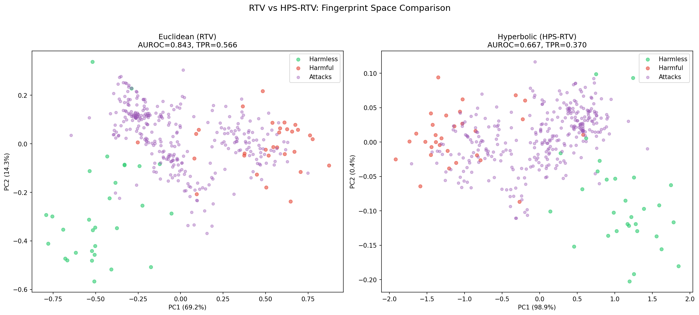
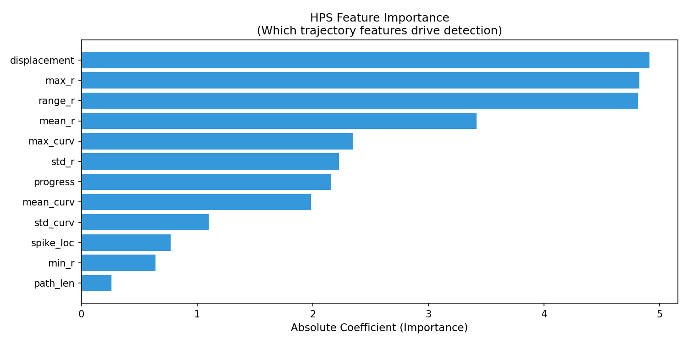
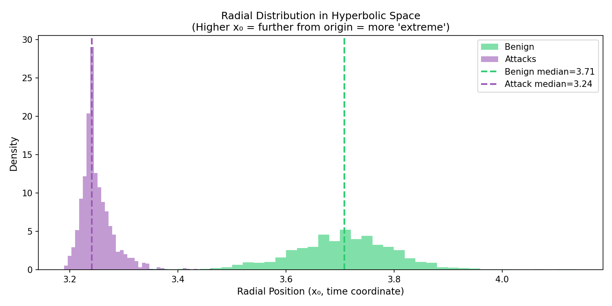
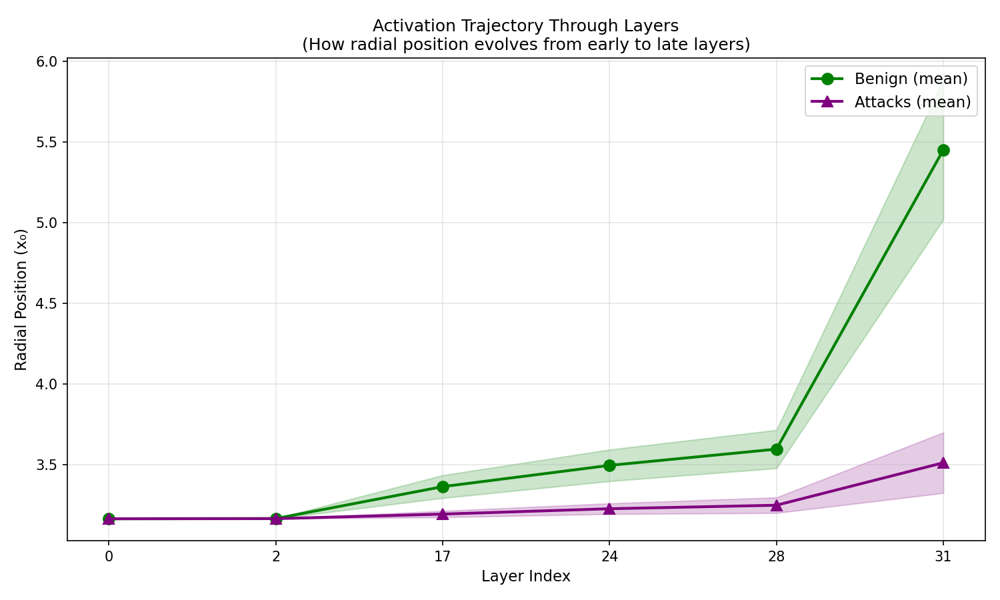
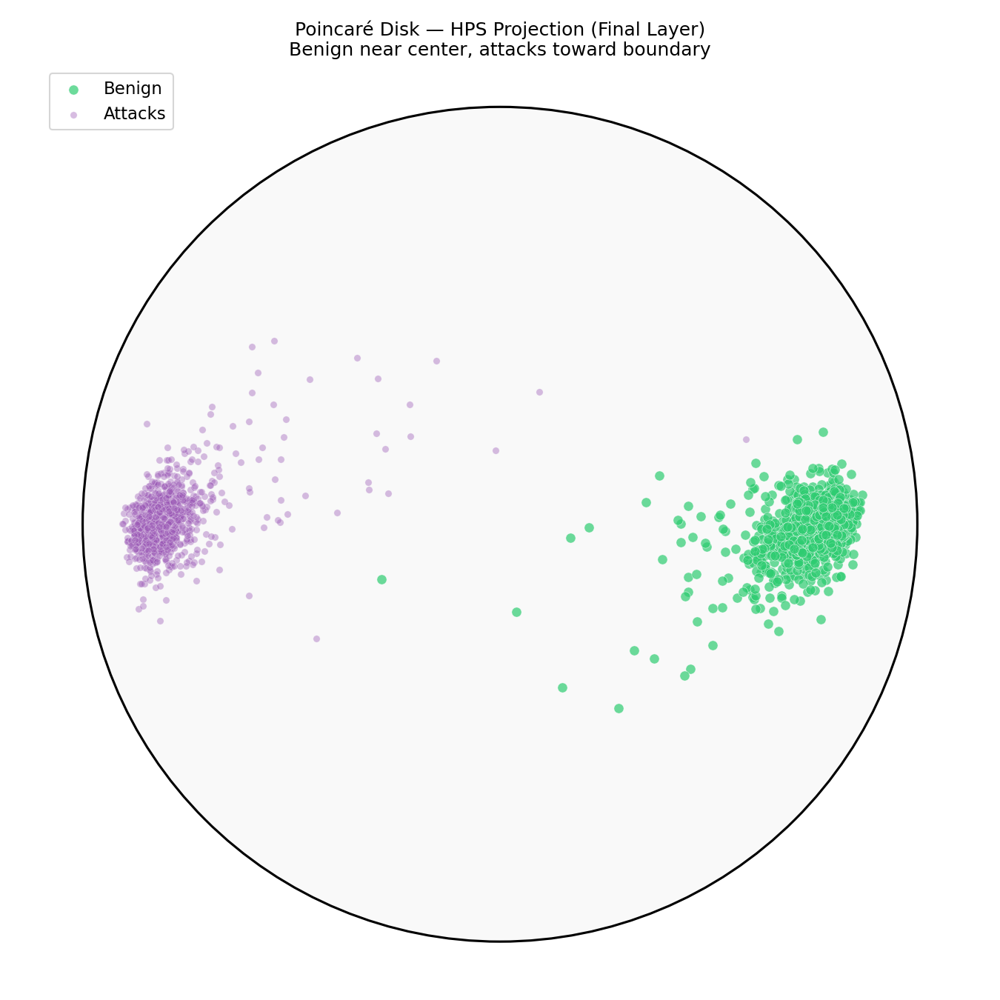

# HPS Research Journey

**Date:** May 2026

---

## TL;DR

**Question:** Do hyperbolic geometric priors help jailbreak detection from LLM activations?

**What we built:**
- **HPS** (our framework): Lorentz projection of multi-layer activations + contrastive training + 12 trajectory features (radial, curvature, displacement) + LR classifier
- **C4** (controlled baseline): mean-pool 6 layers + LR — the simplest possible activation probe

**Top-line finding:** **Geometric priors provide no consistent advantage.** A 4097-parameter linear probe (C4) matches our 262K-parameter geometric framework (HPS) in every regime tested. HPS additionally fails on Vicuna and is more vulnerable to activation perturbation.

**Honest caveat:** Linear probes on hidden states are **not novel** — they are deployed in production at Anthropic and Google DeepMind. We did not "discover" a missed baseline; we contributed a **rigorous controlled comparison** of geometric vs linear methods.

**Status:** Publishable as a rigorous empirical study with negative findings. Not a "new SOTA defense" paper.

---

## The Research Question

LLM token embeddings show empirical signs of hyperbolic structure (HypLoRA NeurIPS 2025; HELM NeurIPS 2025). Hyperbolic geometry is the natural space for hierarchical / tree-structured data (Nickel & Kiela 2017). If LLM hidden states encode hierarchical concepts (general → specific, harmless → harmful), then a hyperbolic projection should provide a useful inductive bias for jailbreak detection.

We set out to test this empirically.

---

## What We Built

### HPS — Hyperbolic Projection Sentinel (our framework)

```
Activations from N=6 layers
        ↓
Learned linear projection W ∈ ℝ^(d × 64)
        ↓
Map to Lorentz hyperboloid (curvature κ)
        ↓
Trajectory features (12-dim):
  • Radial (5):     mean / max / min / std / range of x_0
  • Curvature (4):  triangle-inequality bending across layers
  • Displacement (3): start-end distance, path length, progress
        ↓
Logistic regression
        ↓
Detection score
```

**Training:** per-layer-temperature contrastive loss in Lorentz space, 50 epochs, AdamW.
**Parameters:** ~262K total (projection W + κ + per-layer τ + LR)

### C4 — Mean-pool linear probe (controlled baseline)

```
Activations from same N=6 layers (last token)
        ↓
Mean-pool across layers: feature = (1/6) Σ h_l ∈ ℝ^4096
        ↓
StandardScaler
        ↓
Logistic regression
        ↓
Detection score
```

**Parameters:** 4,097 (one weight per dim + bias)
**Inspiration:** Anthropic Cheap Monitors mean-token probes (we mean-pool layers; they mean-pool tokens)

### Other methods we compared against

| Method | What it does | Source |
|---|---|---|
| **HPS-Euclidean (matched)** | Same as HPS but flat instead of Lorentz, parameter-matched | Our ablation |
| **RTV** | Refusal direction cosine fingerprint + Mahalanobis | Derya & Sunar 2026 (preprint) |
| **JBShield-D** | Concept activation AND-gate | Zhang et al. USENIX 2025 |
| **C1, C2, C3, C5** | Various controls (raw norm, untrained projection, etc.) | Our ablations |

---

## What We Found

### 1. At saturation, HPS ties C4 (Llama-3-8B)

| Method | AUROC | TPR @ 5% FPR |
|---|---|---|
| **HPS** | **1.000** | **1.000** |
| **C4** | **1.000** | **1.000** |
| HPS-Euclidean (matched) | 0.999 | 0.998 |
| RTV | 0.854 | 0.551 |
| JBShield-D (reproduced) | — | 0.55 acc |

The geometric framework matches the simple baseline. Both saturate.



### 2. Cross-attack generalization (leave-one-out, Llama-3)

| Method | Mean cross-attack TPR |
|---|---|
| **HPS** | 0.997 |
| **C4** | 0.992 |
| RTV | 0.549 |

Within statistical noise. **Caveat:** Leave-one-out within our 9-attack benchmark is not true distribution shift — see Limitations.

### 3. Cold-start regime: HPS shows narrow advantage on Llama-3, fails on Vicuna

**Llama-3-8B (works):**

| N per method | HPS | C4 | HPS-Euclidean |
|---|---|---|---|
| 5 | 0.978 | 0.996 | 0.244 |
| 10 | 0.985 | 0.998 | 0.420 |
| 25 | 0.992 | 0.998 | 0.738 |
| 100 | 0.999 | 1.000 | 0.978 |

HPS beats parameter-matched Euclidean projection at low data, but **C4 also achieves high TPR at low data** — the hyperbolic prior does not give an advantage over the no-projection baseline.

**Vicuna-13B (HPS fails):**

| N per method | HPS | C4 | Δ |
|---|---|---|---|
| 5 | 0.340 | 0.933 | -0.593 |
| 10 | 0.286 | 0.963 | -0.677 |
| **25** | **0.068** | **0.985** | **-0.917** |
| 50 | 0.246 | 0.974 | -0.727 |

**HPS catches only 6.8% of attacks at N=25 on Vicuna while C4 catches 98.5%.** A 24-config hyperparameter sweep does not rescue HPS — best HPS = 0.769, still 0.149 below C4. Optimal κ differs: 0.1 on Llama-3 vs 2.0 on Vicuna — hyperparameters do not transfer across models.

### 4. Activation-space perturbation: HPS is more brittle than C4

**Caveat first:** This is NOT a realistic adversarial threat model. Real attackers cannot directly perturb activations — they must work through input space (Bailey et al. 2024). This analysis tests the *robustness property* of the features, not actual security.

**Llama-3 PGD ε=0.05 evasion:**

| Method | Evasion rate |
|---|---|
| HPS | 96% |
| C4 | 2% |
| HPS-Adv (PGD adversarial training) | 96.9% |

HPS's compressed feature space (single dominant feature — see #6 below) has a directional weakness exploitable in activation space. C4's higher dimensionality (4096 features) is harder to perturb in this idealized setting. Adversarial training does NOT fix HPS.

### 5. Trajectory features collapse to a single feature

We tried 8 different feature subsets:

| Subset | #features | Same-dist TPR | Cold-start N=5 TPR |
|---|---|---|---|
| All 12 | 12 | 1.000 | 0.988 |
| Radial only (5) | 5 | 1.000 | 0.991 |
| **mean_r alone** | **1** | **1.000** | **0.996** |
| Curvature only (4) | 4 | 0.995 | 0.970 |

A single feature (mean radial position) suffices on current benchmarks. The 12-feature trajectory framework is over-parameterized.



### 6. The radial distribution contradicts the geometric hypothesis

**Hypothesis:** "Adversarial prompts get pushed to high radial position because they are extreme."

**Empirical reality:**



- Benign median radial position: **3.71** (HIGHER, further from origin)
- Attack median radial position: **3.24** (LOWER, closer to origin)

**This is the opposite of the hypothesis.** The contrastive loss finds whatever direction separates the classes. The Lorentz geometry constrains that direction to be radial, but the *semantic* interpretation (radial = extremity) is not what the model learned. This is direct mechanistic evidence that the geometric prior provides class separation but not the hypothesized hierarchical semantics.

### 7. Curvature κ matters within HPS but signals regularization, not hierarchy

| κ | Llama-3 AUROC | Llama-3 TPR |
|---|---|---|
| 0.1 (best) | **0.999** | **0.998** |
| 0.5 | 0.922 | 0.608 |
| 1.0 | 0.923 | 0.590 |
| 2.0 | 0.922 | 0.577 |
| 10.0 | 0.879 | 0.413 |

Smaller κ = more curvature = more regularization. Best κ differs across LLMs. This is consistent with κ acting as implicit regularization rather than as a hierarchical prior.

### 8. Layer selection matters more than geometry

| Layer config | HPS AUROC | C4 AUROC |
|---|---|---|
| Spread [0,2,17,24,28,31] | **1.000** | 0.999 |
| Fisher-discovered [0,1,2,28-31] | 0.925 | 0.998 |
| Late only [28-31] | 0.981 | 0.998 |
| Shallow only [0,1,2] | 0.942 | 0.992 |

C4 is robust to layer choice. HPS depends on layer choice significantly.

### 9. Trajectory through hyperbolic space



Layer-by-layer trajectories of benign vs attack prompts in the projected space. Both classes occupy a similar radial band — the "exponential volume growth" advantage of hyperbolic space is not exploited.



---

## What This Means

### What we actually contributed (not what we initially claimed)

1. **HPS framework** — architecturally novel construction (no published equivalent), but no empirical advantage over simpler baselines
2. **Direct geometric vs linear comparison** — first such rigorous head-to-head with parameter matching
3. **Cold-start regime methodology** — varying N, varying #methods, leave-one-out
4. **Multi-LLM HPS fragility analysis** — others don't test geometric methods across LLMs
5. **Methodology fixes** — threshold leakage protocol, multi-seed reporting, parameter matching
6. **Honest negative result** — geometric priors don't help; established linear probes are matched, not exceeded

### What is NOT a contribution (we initially overstated)

- ❌ "We discovered linear probes work for jailbreak detection" — Anthropic Cheap Monitors (2025), Google DeepMind Gemini Probes (Jan 2026), and Detecting High-Stakes Interactions with Activation Probes (ICML 2025) established this approach
- ❌ "We found a baseline the field missed" — this overstates novelty; linear probes are deployed in production at Anthropic and Google DeepMind
- ❌ "C4 beats SOTA" — JBShield (USENIX 2025) didn't include strong linear probe baselines, but Anthropic and Google did publish similar approaches

### Why the negative finding still matters

1. **Specific peer-reviewed jailbreak-defense papers** (HSF WWW 2025, JBShield USENIX 2025, GradSafe ACL 2024, Gradient Cuff NeurIPS 2024, Token Highlighter AAAI 2025) did not include strong activation-level linear-probe baselines in their direct comparisons. Our work closes this gap.
2. **The geometric framework approach is now empirically tested** — future researchers know hyperbolic priors don't help on these benchmarks
3. **The cold-start regime methodology** is reusable for evaluating future defenses
4. **The radial distribution finding** is mechanistic evidence that geometric priors don't enforce hypothesized semantics

---

## Limitations (must be honest about these)

### 1. Linear probes are established prior art
Anthropic Cheap Monitors, Google DeepMind Gemini probes, ICML 2025 (Detecting High-Stakes Interactions with Activation Probes), Bricken et al. 2024, and others have established the linear probe approach. C4 is structurally similar but not novel.

### 2. Cross-attack TPR may reflect benchmark saturation
Leave-one-out evaluation within our 9-attack benchmark is not true distribution shift. Concurrent work shows:
- "What Features in Prompts Jailbreak LLMs?" (arXiv:2411.03343): probes fail OOD on truly novel attacks
- "When Benchmarks Lie" (ICLR 2026 AIWILD): standard evaluation overestimates true OOD AUC by 8.4 percentage points

Our 0.992 cross-attack TPR may not generalize to genuinely novel attacks.

### 3. Activation-space PGD is not a realistic threat model
Real adversarial attacks operate in input space (Bailey et al. 2024 "Obfuscated Activations Bypass LLM Latent-Space Defenses"). Our PGD analysis tests feature robustness *property*, not deployable security.

### 4. Confidence intervals not yet computed
Multi-seed σ values are reported, but bootstrap CIs and formal hypothesis tests (McNemar's, paired bootstrap) on per-example predictions are needed before any submission. Script `statistical_tests.py` is ready but needs to be run.

### 5. Non-standardized benchmark
Our 9 attacks (autodan, base64, drattack, gcg, ijp, pair, puzzler, saa, zulu) are custom-assembled. Standard benchmarks like JailbreakBench / HarmBench would enable direct cross-paper comparison.

### 6. Two LLMs is a small sample
Vicuna-13B and Llama-3-8B. Adding a third (Mistral, Qwen) would broaden cross-model claims.

### 7. Have NOT reproduced peer-reviewed activation-based defenses
HSF (WWW 2025), GradSafe (ACL 2024), Gradient Cuff (NeurIPS 2024) — we have read their papers and confirmed they don't include linear probes in baselines, but we have not directly run them on our benchmark.

---

## Open Questions and Next Steps

### Immediate (1 week)

- **Run `statistical_tests.py`** to add bootstrap CIs and formal tests on HPS vs C4
- **Verify radial distribution** finding on more checkpoints (we observed it on the trained model)

### Short-term (2-4 weeks)

- **Reproduce HSF** (Qian et al. WWW 2025) on our Llama-3 + 9-attack benchmark
- **Reproduce GradSafe** (Xie et al. ACL 2024) — different signal type (gradient-based)
- **Test on standardized benchmarks** (JailbreakBench, HarmBench)

### Medium-term (2-3 months) — exploratory, unproven

- **Multi-turn jailbreak detection.** Conversation trees genuinely have hierarchical structure where hyperbolic priors might help. We have not yet tested this. The C4 baseline might also extend to multi-turn — it's an empirical question. Datasets: DIA, sequential PAIR variants, SequentialBreak.
- **Agentic / tool-use jailbreak monitoring.** Action sequences with branching tool calls have tree structure. Existing benchmarks: InjecAgent, AgentDojo. Whether geometric priors help is unknown.
- **Realistic adaptive attacks.** Replace activation-space PGD with input-space prompt optimization à la Bailey et al. 2024. This is the proper threat model.

### Longer-term (3-6 months)

- **Cross-model transferable concept embeddings.** A defense that works across LLMs without per-model retraining. Train concept-aligned hyperbolic embedding (HySAC-style); test transfer Llama-3 → Vicuna.
- **Larger LLM evaluation.** Llama-3-70B, Qwen-72B — does HPS fragility persist at scale?

### What NOT to do

- ❌ More HPS hyperparameter tuning — exhausted (24-config sweep already done)
- ❌ More geometric variants on same benchmarks (Möbius, Poincaré ball) — Lorentz vs Euclidean parity already shows geometry doesn't help here
- ❌ More trajectory features — single feature already suffices

---

## Summary

**The work produced rigorous methodology and an honest negative finding.**

We built HPS (architecturally novel framework) and C4 (controlled baseline structurally similar to deployed industry approaches). After comprehensive comparison across 2 LLMs, 9 attack families, multiple data regimes, and perturbation analysis:

- Geometric priors do not help on standard activation-based jailbreak detection benchmarks
- HPS is fragile (catastrophic Vicuna failure, hyperparameters don't transfer, perturbation-vulnerable)
- The radial distribution contradicts the geometric hypothesis — direct mechanistic evidence
- Linear probes (C4-style) match HPS while being deployed in production at Anthropic and Google DeepMind

**This is publishable as a rigorous empirical study.** The contribution is the comprehensive comparison + cold-start methodology + multi-LLM fragility analysis, not a new defense.

**Three options to discuss:**

1. **Submit existing study to TMLR** after critical fixes (1 week of CI/statistical work + literature update). ~60-65% acceptance probability for an honest empirical study with negative findings.

2. **Add HSF + GradSafe reproductions** before submitting (additional 2-3 weeks). Strengthens the comparison; also enables venues with stricter peer-reviewed-comparison requirements.

3. **Pivot to multi-turn / agentic** before publishing (additional 2-3 months). Higher risk: hyperbolic might not help there either. Could result in a stronger paper if it works, or another negative finding if not.

My recommendation: **Option 2.** Do the critical fixes + reproductions, submit a strong honest empirical paper. The multi-turn pivot can come after, on top of established methodology and tooling.

---

## Files

**Main pipeline scripts:**
- `hps_llama3.py` — Llama-3 main experiment (HPS + Euclidean baseline + ablations)
- `experiment7.py` — Vicuna pipeline with C4 baseline
- `cross_model_compare.py` — Vicuna replication with HPS fragility analysis
- `vicuna_param_sweep.py` — 24-config hyperparameter rescue attempt
- `attack_ensemble.py` — HPS+RTV ensemble (adaptive PGD)
- `experiment12.py` — HPS-Adv (adversarial training)

**Diagnostic / verification scripts:**
- `diagnostic_hps_vs_euc.py` — 10 tests covering layer selection, κ ablation, etc.
- `verify_new_config.py` — cold-start regime evaluation (Parts A-E)
- `feature_ablation.py` — 8 feature subsets across 5 regimes
- `control_experiments.py` — C1-C5 controls + activation magnitude
- `adversarial_compare.py` — HPS vs C4 PGD (activation-space perturbation)

**To be added:**
- `statistical_tests.py` — bootstrap CIs + McNemar's test (CREATED, needs to be run)

**Visualization:**
- `visualize_hps.py` — generates plots in `results/`
- `generate_paper_plots.py` — paper figure generation

**Key result files (in `results/`):**
- `hps_vs_rtv_llama3.json` — Llama-3 main results
- `verify_new_config.json` — cold-start regime
- `feature_ablation.json` — feature subset comparison
- `control_experiments.json` — C1-C5 controls
- `adversarial_compare.json` — HPS vs C4 perturbation analysis
- `cross_model_compare.json` — Vicuna replication
- `vicuna_param_sweep.json` — hyperparameter rescue attempt
- `paper_supplementary.json` — multi-seed stability

**Key plots:**
- `results/hps_rtv_results_comparison.png` — method comparison
- `results/viz_radial_distribution.png` — **the radial distribution surprise**
- `results/viz_feature_importance.png` — feature importance
- `results/viz_trajectory.png` — trajectory through hyperbolic space
- `results/viz_poincare_disk.png` — Poincaré disk view
- `results/hps_llama3_clusters.png` — cluster visualization
- `results/rtv_llama3_results_clusters.png` — RTV cluster comparison

**Documents:**
- `research_journey.md` — this document
- `literature_review_activation_defenses.md` — comprehensive related work analysis
- `paper_outline.md` — proposed paper structure
- `evaluation_report.md` — AI evaluator's review of the work

---

## Sources

**Industry-deployed activation probes (we did NOT discover linear probes):**
- ⚠️ External link — [Anthropic: Cost-Effective Constitutional Classifiers via Representation Re-use](https://alignment.anthropic.com/2025/cheap-monitors/) — accessed 2026-05-25
- ⚠️ External link — [Google DeepMind: Building Production-Ready Probes For Gemini](https://arxiv.org/abs/2601.11516) — accessed 2026-05-25
- ⚠️ External link — [Detecting High-Stakes Interactions with Activation Probes (ICML 2025)](https://arxiv.org/abs/2506.10805) — accessed 2026-05-25

**Concurrent work also testing linear probes:**
- ⚠️ External link — [Latent Sentinel: Real-Time Jailbreak Detection with Layer-wise Probes (ICLR 2026 withdrawn)](https://openreview.net/forum?id=tuFRx6Ww2n) — accessed 2026-05-25
- ⚠️ External link — [When Benchmarks Lie (ICLR 2026 AIWILD Workshop)](https://openreview.net/forum?id=jWIOJOQqne) — accessed 2026-05-25
- ⚠️ External link — [What Features in Prompts Jailbreak LLMs?](https://arxiv.org/abs/2411.03343) — accessed 2026-05-25

**Peer-reviewed jailbreak-specific defenses (none included strong linear probe baselines):**
- ⚠️ External link — [HSF: Defending against Jailbreak Attacks with Hidden State Filtering (WWW 2025)](https://arxiv.org/abs/2409.03788) — accessed 2026-05-25
- ⚠️ External link — [GradSafe (ACL 2024)](https://arxiv.org/abs/2402.13494) — accessed 2026-05-25
- ⚠️ External link — [JBShield (USENIX Security 2025)](https://arxiv.org/abs/2502.07557) — accessed 2026-05-25
- ⚠️ External link — [Gradient Cuff (NeurIPS 2024)](https://arxiv.org/abs/2403.00867) — accessed 2026-05-25
- ⚠️ External link — [Token Highlighter (AAAI 2025)](https://arxiv.org/abs/2412.18171) — accessed 2026-05-25

**Hyperbolic geometry motivation:**
- ⚠️ External link — [HypLoRA (NeurIPS 2025)](https://arxiv.org/abs/2405.18515) — accessed 2026-05-25
- ⚠️ External link — [HELM (NeurIPS 2025)](https://arxiv.org/abs/2505.24722) — accessed 2026-05-25
- ⚠️ External link — [Nickel & Kiela: Poincaré Embeddings (NeurIPS 2017)](https://arxiv.org/abs/1705.08039) — accessed 2026-05-25

**Threat model / adaptive attacks:**
- ⚠️ External link — [Bailey et al.: Obfuscated Activations Bypass LLM Latent-Space Defenses (ICLR 2026)](https://arxiv.org/abs/2412.09565) — accessed 2026-05-25
- ⚠️ External link — [Wollschläger et al.: Geometry of Refusal in LLMs (ICML 2025)](https://arxiv.org/abs/2502.17420) — accessed 2026-05-25
